64-31.1 Projet de technologie web
<!-- .element: style="font-size:0.7em;margin:4em 0;" -->

# CSS

## Cascading Style Sheets


<!-- .element: style="position:absolute; top:0; left:0;width:40%;" class="nopdf" -->


<!-- .element: style="position:absolute; top:0; right:0;width:10%;" class="nopdf" -->

[Boris.Fritscher@he-arc.ch](mailto:Boris.Fritscher@he-arc.ch)

<!-- .element: class="bottom left nopdf" -->


CSS : Cascading Style Sheets

Les styles définissent les **propriétés visuelles** des éléments,
ils sont définis dans une **syntaxe** spécifique (CSS),
dans la mesure du possible, ils sont définis **séparément** des éléments HTML.

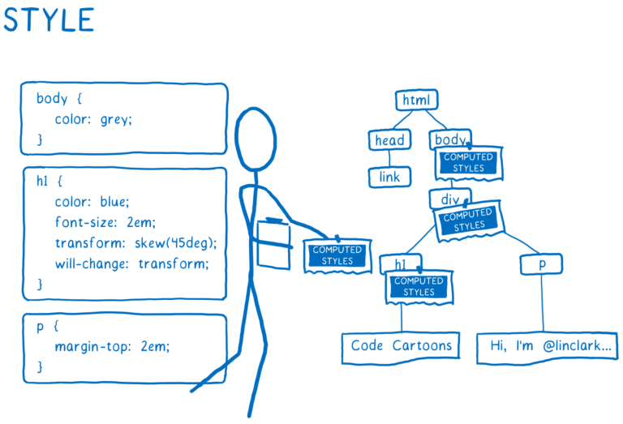<!-- .element: class="w-60" -->
<!-- .element: class="center" -->

https://hacks.mozilla.org/2017/08/inside-a-super-fast-css-engine-quantum-css-aka-stylo/
<!-- .element: class="credits" -->


### Syntax CSS

Un ensemble de règles CSS contenues dans une **feuille de style** détermine l'apparence d'une page Web.

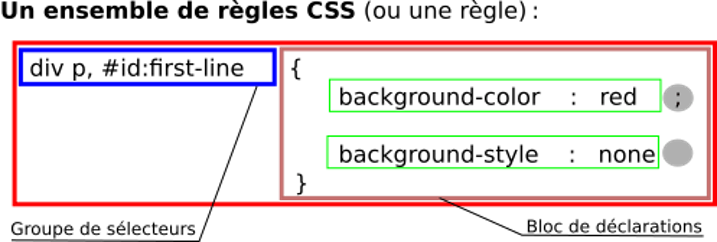

<!-- .element: class="center" -->

https://developer.mozilla.org/fr/docs/Apprendre/CSS/Introduction_%C3%A0_CSS/La_syntaxe
<!-- .element: class="credits" -->


### Déclarations CSS


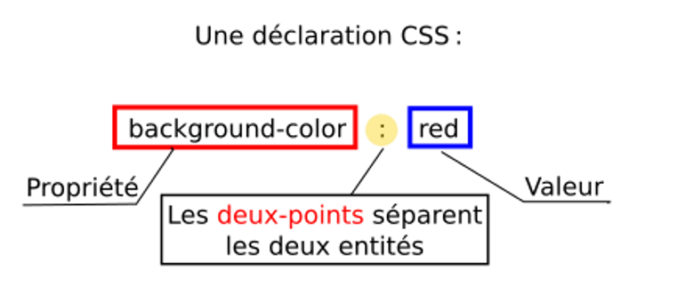

<!-- .element: class="center" -->

https://developer.mozilla.org/fr/docs/Apprendre/CSS/Introduction_%C3%A0_CSS/La_syntaxe
<!-- .element: class="credits" -->


### Comment appliquer les CSS aux HTML

#### Externe `<link>` dans `<head>`

Fichier html
```html
<html>
  <head>
    <link rel="stylesheet" href="style.css" />
  </head>
  <body>
     <h1>Titre</h1>
  </body>
</html>
```

Fichier style.css
```css
h1 {
  color: blue;
  background-color: yellow;
  border: 1px solid black;
}
```


#### Interne: `<style>`dans `<head>`

```html
<html>
  <head>
    <style>
      h1 {
        color: blue;
        background-color: yellow;
        border: 1px solid black;
      }
    </style>
  </head>
  <body>
    <h1>Titre</h1>
  </body>
</html>
```

#### En ligne: attribut `style` dans la balise

```html
<h1 style="color: blue;background-color: yellow;border: 1px solid black;">Salut, ô Monde!</h1>
```
Ne faites pas cela, à moins d'y être obligé !

<!-- .element: class="warn center" -->


#### Exemples de bonne séparation contenu / présentation

[Zen Garden – The Beauty of CSS Design](http://www.csszengarden.com)

<style>
  iframe.demo:hover {
    z-index: 999;
  }
</style>
<iframe class="demo" src="http://www.csszengarden.com/221/" style="width:1024px;height:768px;transform:scale(0.5) translate(-50%,-30%) rotate(-20deg);position:absolute;left:0;"></iframe>

<iframe class="demo" src="http://www.csszengarden.com/214/" style="width:1024px;height:768px;transform:scale(0.5) translate(-10%,-40%) rotate(-10deg);position:absolute;left:0"></iframe>

<iframe class="demo" src="http://www.csszengarden.com/215/" style="width:1024px;height:768px;transform:scale(0.5) translate(20%,-20%) rotate(5deg);position:absolute;left:0"></iframe>

<iframe class="demo" src="http://www.csszengarden.com/209/" style="width:1024px;height:768px;transform:scale(0.5) translate(70%,-10%) rotate(20deg);position:absolute;left:0"></iframe>


### Les selecteurs simples

Sélecteurs d'éléments `div, h1, p, …`
```css
h1 { color: blue; }
```


Sélecteurs de classes

```css
.nom_de_classe { color: blue; }
```

```html
<h1 class="nom_de_classe">Salut, ô Monde!</h1>
```


Sélecteurs d'identifiants

```css
#titre-page { color: blue; }
```

```html
<h1 id="titre-page">Salut, ô Monde!</h1>
```

Un nom d'ID doit être unique dans le document.
<!-- .element: class="warn" -->

https://developer.mozilla.org/fr/docs/Apprendre/CSS/Introduction_%C3%A0_CSS/Simple_selectors
<!-- .element: class="credits" -->


| CSS Selector     | Action                                                              |
|------------------|---------------------------------------------------------------------|
| *		             | sélectionne tous les éléments.
| aa *		         | sélectionne tous les éléments à l'intérieur d'un élément aa.
| aa bb		         | sélectionne tous les éléments bb à l'intérieur d'un élément aa.
| aa, bb	         | sélectionne tous les éléments aa et tousles éléments bb.
| aa.classname	   | sélectionne tous les éléments aa avec le nom de classe classname.
| #idname	         | sélectionne l'élément avec l'id idname.
| a:hover	         | sélectionne l'élément a si la souris le survole (pseudo-classes).
| aa > bb	         | sélectionne tous les éléments bb qui sont un enfant direct d'un élément aa.
| aa + bb	         | sélectionne l'élément bb s'il est immédiatement précédé de aa.
| aa ~ bb	         | sélectionne tous les éléments bb précédés d'un élément aa.
| aa[attr="value"] | sélectionne l'élément aa avec un attribut attr="value".
| :first-child     | sélectionne tous les éléments qui sont premier enfant.
| :nth-child(A)    | sélectionne chaque élément qui est l'enfant Ath d'un autre élément.

Visualization:
[CSS Visualizer](https://fritscher.ch/dom-css/)

Exercise:
[CSS Diner](https://flukeout.github.io/)


### Styles de base – couleurs

En CSS les propriétés color et background-color permettent de changer l'apparence d'éléments HTML.

La couleur peut être spécifiée dans plusieurs formats:
<!-- .element: class="small" -->

 - nom d'une couleur `blue`
 - code RGB (Red, Green, Blue) `rgb(0, 0, 255)`
 - code RGB en hexadécimal `#0000FF`

<!-- .element: class="small" -->

<iframe src="https://csb-l1fqq.netlify.com/?color=rgb(0,0,255)" style="width:260px;height:250px;border-radius:5px;"></iframe>
<!-- .element: class="float-right" -->

Il existe aussi une version raccourcie simplifiée du code hexadécimal. Elle remplace toutes les doubles valeurs par une valeur simple: `#00F`
<!-- .element: class="smaller" -->

https://developer.mozilla.org/fr/docs/Web/CSS/Type_color
<!-- .element: class="credits bottom" -->


### CSS formats des textes

```css
font-family: [Times New Roman, serif, Arial, sans-serif, Consolas, monospace];
font-style: [normal, italic];
font-weight: [normal, bold, 100-900];
```
<span style="font-family: Times New Roman">Times New Roman,</span>
<span style="font-family: Arial">Arial,</span>
<span style="font-family: Consolas">Consolas,</span>
<span>Open Sans est d'autres disponibles sur [WebFonts](https://fonts.google.com/)</span>.

<!-- .element class="small" -->

famille générique: serif, sans-serif, monospace
<!-- .element class="smaller" -->
famille spécifique: "Times New Roman", Times, Arial, Courrier, …
<!-- .element class="smaller" -->

Si une font n'est pas trouvé la plus proche sera choisie.
Dans chrome computed style peremt de voir ce qui a réelement été utilisé.
<!-- .element class="smaller" -->


### Taille de polices de caractères (fontes)

font-size: taille des caractères

on peut préciser la taille de différentes manières:
<!-- .element class="small" -->
- de façon absolue et fixe: en points (pt) ou en pixels (px),
- de façon relative et adaptable par l'utilisateur: en multiples (em) de la taille de base, ou avec les mots-clés: small,  medium,  large,  x-large
la taille par défaut est 1em = 16px.

<!-- .element class="small" -->

Exemples:

```css
font-size: 1.5em;   /*  150% de la largeur courante */
font-size: 18pt;    /*  une taille fixe, quelque soit
                        l'agrandissement pratiqué par l'utilisateur. */
```


### Alignement de texte

alignement du texte par rapport à l'élément
```css
text-align: [ center, left, right, justify];
```

indentation de la première ligne de l'élément
```css
text-indent: [25px, 1em];
```
voir aussi les propriétés:

`line-height, letter-spacing, text-decoration, text-transform`


### Text-shadow


<div style="font-size:80px;color:#f0f0f0; text-shadow:0 1px 0 hsl(174,5%,80%), 0 2px 0 hsl(174,5%,75%),0 3px 0 hsl(174,5%,70%),0 4px 0 hsl(174,5%,66%), 0 5px 0 hsl(174,5%,64%),0 6px 0 hsl(174,5%,62%),0 7px 0 hsl(174,5%,61%),0 8px 0 hsl(174,5%,60%),0 0 5px rgba(0,0,0,.05),0 1px 3px rgba(0,0,0,.2),0 3px 5px rgba(0,0,0,.2), 0 5px 10px rgba(0,0,0,.2), 0 10px 10px rgba(0,0,0,.2),0 20px 20px rgba(0,0,0,.3);">... d'autres effets de folie!</div>

https://css-tricks.com/almanac/properties/t/text-shadow/

<!-- .element class="smaller" -->


### Typography

Ty­pog­ra­phy mat­ters be­cause it helps con­serve reader at­ten­tion.

Good ty­pog­ra­phy can help your reader de­vote less at­ten­tion to the me­chan­ics of read­ing and more at­ten­tion to your mes­sage

http://practicaltypography.com/

<!-- .element: class="credits" -->


### Which is more readable?


<!-- .element: class="float-left w-50" -->


<!-- .element: class="float-right w-50" -->

A high­way sign has a spe­cial pur­pose: it’s meant to be read quickly, from long dis­tances, at odd an­gles, and un­der vari­able light­ing and weather con­di­tions.

http://practicaltypography.com/

<!-- .element: class="credits" -->


### Same font different balance

<!-- .element: class="w-80" -->

<!-- .element: class="center" -->

http://practicaltypography.com/

<!-- .element: class="credits" -->


### **Underlining** *Absolutely not*

<u>Un­der­lin­ing is an­other dreary type­writer habit. Type­writ­ers had no bold or italic styling. So the only way to em­pha­size text was to back up the car­riage and type un­der­scores be­neath the text. It was a workaround for short­com­ings in type­writer technology.</u>

Nei­ther your word proces­sor nor your web browser suf­fers from these short­com­ings. If you feel the urge to un­der­line, use **bold** or *italic* in­stead. In spe­cial sit­u­a­tions, like head­ings, you can also con­sider us­ing ALL CAPS, <span style="font-variant: small-caps">small caps</span>, or a change in <span style="font-size: 130%">point size</span>.

http://practicaltypography.com/

<!-- .element: class="credits" -->


<!-- .slide: data-background="images/typography-terminology.jpg" -->
<a href="https://www.supremo.tv/typeterms" target="_blank" style="width:100%;height:80vh;display:block;"></a>


### What is typography?

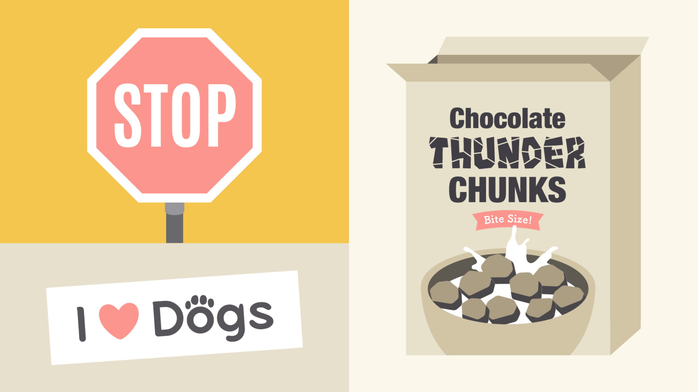<!-- .element: class="w-80" -->

<!-- .element: class="center" -->

https://www.gcflearnfree.org/beginning-graphic-design/typography/1/

<!-- .element: class="smaller" -->


### CSS background

```css
background-color: [#color, gradient];
background-image: url('..image.jpg');
background-position: x y;
background-repeat: [repeat, repeat-x, repeat-y, no-repeat, space, round];
background-size: [auto, x y, cover, contain];

background-clip: [border-box, padding-box, content-box, inherit];
background-origin: [border-box, padding-box, content-box, inherit];
background-attachment: [scroll, fixed, local];
```

- https://css-tricks.com/almanac/properties/b/background/
- http://www.colorzilla.com/gradient-editor/

<!-- .element class="smaller" -->


### Styles des liens (ancres `<a href=>`)

Les liens sont importants pour la navigation: essentiel de les rendre **bien visibles**. On peut distinguer les différents états du lien avec des pseudo-classes:
<!-- .element: class="small" -->

- a:link     - un lien normal, jamais visité,
- a:visited – un lien déjà visité par l'utilisateur,
- a:hover  - un lien au moment où la souris passe dessus,
- a:active  - un lien au moment où on clique.

<!-- .element: class="small" -->

Exemple:
```css
a:link { color:#FF0000; }
a:visited { color:#00FF00; } 
a:hover { color:#FF00FF; } 
a:active { color:#0000FF; }
```
```html
<a href=#top>test</a>
```
<!-- .element: class="hide" -->

Recommandation: réserver le souligné aux liens, les éviter ailleurs !

<!-- .element: class="warn small" -->


### Styles des listes

On peut préciser le marqueur d'éléments de la liste:

pour les listes non ordonnées `<ul>`:

`list-style-type: none, disc, circle, square  ;`
<!-- .element: class="small" -->

pour les listes ordonnées `<ol>`:

`list-style-type: decimal, lower-roman, upper-roman, lower-alpha, upper-alpha, lower-greek, hebrew, … ;`
<!-- .element: class="small" -->
il existe d'autres valeurs possibles, consulter la norme !
<!-- .element: class="smaller" -->

pour fournir une image comme marqueur:

`list-style-image: url('petit_bouton_rouge.gif');`
<!-- .element: class="small" -->


DOM (Document Object Model)

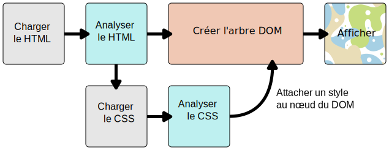

https://developer.mozilla.org/fr/docs/Apprendre/CSS/Introduction_%C3%A0_CSS/Le_fonctionnement_de_CSS
<!-- .element: class="credits" -->


<!-- .element: class="w-60" -->
<!-- .element: class="center" -->

https://hacks.mozilla.org/2017/05/quantum-up-close-what-is-a-browser-engine/
<!-- .element: class="left credits" -->


### La cascade
À son niveau le plus élémentaire, l'ordre des règles CSS est important, mais c'est plus complexe que cela. Le fait qu'un sélecteur l'emporte dans la cascade dépend de trois facteurs:

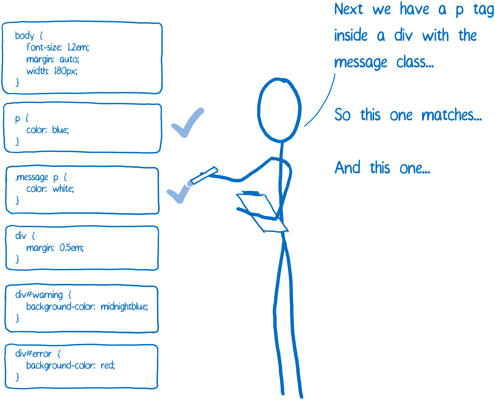
<!-- .element: class="float-left w-50" -->

1. importance
2. particularité (Specificity)
3. ordre dans le source

https://developer.mozilla.org/fr/docs/Apprendre/CSS/Introduction_%C3%A0_CSS/La_cascade_et_l_h%C3%A9ritage
<!-- .element: class="credits right" -->


#### Particularité (Specificity)

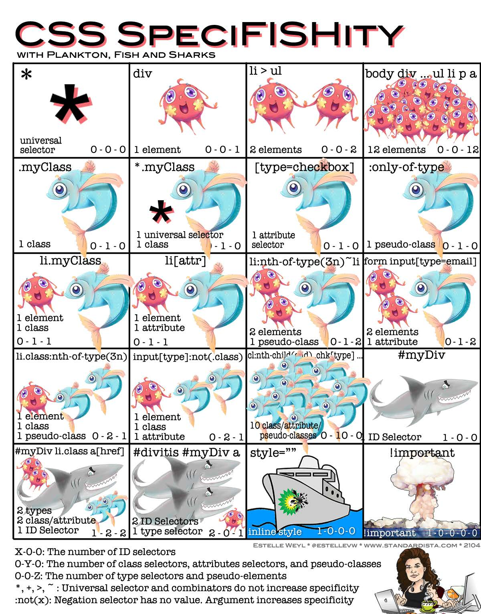<!-- .element: class="w-50" -->

<!-- .element: class="center" -->

http://www.standardista.com/wp-content/uploads/2012/01/specificity3.pdf
<!-- .element: class="credits" -->


```html
<!DOCTYPE html>
<html>
<body>
  <div id="b1" class="box">BOX1</div>
</body>
</html>
```

```css
#b1.box{
  color: yellow;
}

#b1.box{
  color: pink;
}

.box{
  color: green;
}

#b1 {
  color: blue;
}

div {
  color: red;
}
```


### Héritage

Certaines valeurs de propriété appliquées à un élément seront héritées par les enfants de cet élément, et d'autres non.

`font-family` et `color` soient hérités

Alors que `margin`, `padding`, `border` et `background-image` ne sont pas hérités

https://developer.mozilla.org/fr/docs/Apprendre/CSS/Introduction_%C3%A0_CSS/La_cascade_et_l_h%C3%A9ritage
<!-- .element: class="credits" -->


### Le modèle de boîte CSS: box-model


<!-- .element: class="w-50 float-left" -->

***box-sizing: content-box;*** par défaut

***box-sizing: border-box;*** width inclut padding + border

 Les marges ont un comportement spécifique nommé margin collapsing (fusion des marges) : quand deux boîtes se touchent, la distance entre elles a la valeur de la plus grande des deux marges au contact et non leur somme.
<!-- .element: class="small" -->

center a block element: *margin: 0 auto*;

<!-- .element: class="small" -->

https://developer.mozilla.org/fr/docs/Apprendre/CSS/Introduction_%C3%A0_CSS/Le_mod%C3%A8le_de_bo%C3%AEte
<!-- .element: class="credits" -->


### Box-sizing: content-box

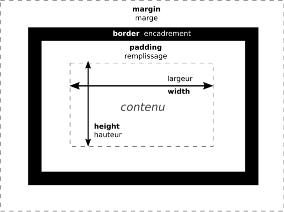

<!-- .element: class="center" -->


### Box-sizing: border-box

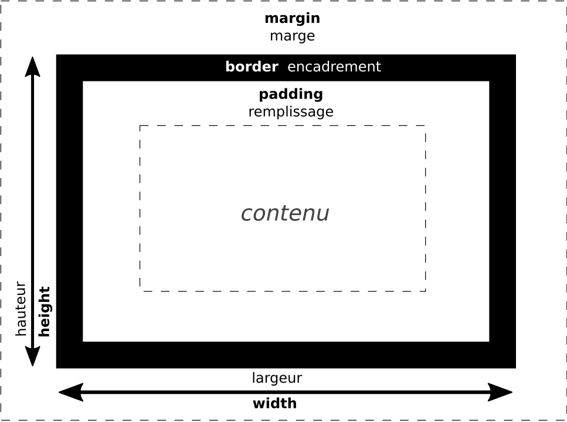

<!-- .element: class="center" -->


### CSS: border

<div style="position:relative" class="float-right">
<div style="width:100px;height:50px;border:4px solid red;position: absolute; top:100px;right:0"></div>
<div style="width:100px;height:50px;border:4px solid red;border-top: 8px dashed green;position: absolute; top:180px;right:0"></div>
<div style="width:100px;height:50px;border:6px solid #0000FF;position: absolute; top:260px;right:0"></div>
<div style="width:100px;height:50px;border:6px solid #0000FF;border-left: 10px double #00FFFF;position: absolute; top:340px;right:0"></div>
<div style="width:100px;height:50px;border:6px solid #0000FF;border-left: 10px double #00FFFF;position: absolute; top:420px;right:0;border-radius: 10px"></div>
</div>

```css
border-width: 4px;
border-color: red;
border-style: solid;

border-top-width: 8px;
border-top-color: green;
border-top-style: dashed;

/* shorthand */
border: 2px solid #0000FF;

border-left: 10px solid #FFFF00;

border-radius: 10px;
```

- https://developer.mozilla.org/en-US/docs/Web/CSS/border-radius?v=example
- http://css3pie.com/demos/border-radius/
- https://developer.mozilla.org/en-US/docs/Web/CSS/CSS_Background_and_Borders/Border-radius_generator

<!-- .element class="smaller" -->


### CSS box-shadow

<div style="background-color: #9EB3EB;width: 100%; height:100px;box-shadow:-7px 13px 4px rgba(0, 0, 0, 0.3), 0px -2px 20px rgba(0, 0, 0, 0.1) inset;"></div>

Utiliser chrome dev-tools pour ajuster box-shadow.


<!-- .element class="w-40 left" -->

- https://css-tricks.com/almanac/properties/b/box-shadow/

<!-- .element class="smaller right" -->


# Exercices

<!-- .element: class="text-white" -->

<!-- .slide: data-background-image="images/background_code.webp" -->

## [CSS Basic Recette](https://github.com/bfritscher/cours-html-exercices/tree/master/CSS_Basic_Recette)
<!-- .element: class="text-white" -->


### Structure de Site Web et de document

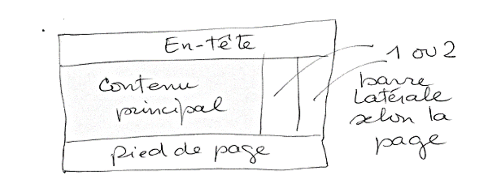


<!-- .element: class="credits" -->


### Marquage sémantique HTML de la page

<ul>
 <li><strong>header : </strong><a href="/fr/docs/Web/HTML/Element/header" title="L'élément HTML <header> représente un groupe de contenu introductif ou de contenu aidant à la navigation. Il peut contenir des éléments de titre, mais aussi d'autres éléments tels qu'un logo, un formulaire de recherche, etc."><code>&lt;header&gt;</code></a>.</li>
 <li><strong>barre de navigation : </strong><a href="/fr/docs/Web/HTML/Element/nav" title="L'élément HTML <nav> représente une section d'une page ayant des liens vers d'autres pages ou des fragments de cette page. Autrement dit, c'est une section destinée à la navigation dans un document (avec des menus, des tables des matières, des index, etc.)."><code>&lt;nav&gt;</code></a>.</li>
 <li><strong>contenu principal : </strong><a href="/fr/docs/Web/HTML/Element/main" title="L’élément HTML <main> représente le contenu majoritaire du <body> du document. Le contenu principal de la zone est constitué de contenu directement en relation, ou qui étend le sujet principal du document ou de la fonctionnalité principale d'une application."><code>&lt;main&gt;</code></a>, avec diverses sous‑sections de contenu représentées à l'aide de des éléments <a href="/fr/docs/Web/HTML/Element/article" title="L'élément HTML <article> représente du contenu autonome dans un document, une page, une application, ou un site. Ceci peut être un message sur un forum, un article de journal ou de magazine, une parution sur un blog, un commentaire d'utilisateur, un widget ou gadget interactif, ou tout autre élément de contenu indépendant. Ce contenu est prévu pour être distribué ou réutilisé indépendamment (par exemple dans un flux de syndication)."><code>&lt;article&gt;</code></a>, <a href="/fr/docs/Web/HTML/Element/section" title="L'élément HTML <section> représente une section générique d'un document, par exemple un groupe de contenu thématique. Une section commence généralement avec un titre."><code>&lt;section&gt;</code></a> et <a href="/fr/docs/Web/HTML/Element/div" title="L'élément HTML <div> (qui signifie division du document) est un conteneur générique qui permet d'organiser le contenu sans représenter rien de particulier. Il peut être utilisé afin de grouper d'autres éléments pour leur appliquer un style (en utilisant les attributs class ou id) ou parce qu'ils partagent des attributs aux valeurs communes, tel que lang. Il doit uniquement être utilisé lorsqu'aucun autre élément sémantique (par exemple <article> ou <nav>) n'est approprié."><code>&lt;div&gt;</code></a>.</li>
 <li><strong>barre latérale : </strong><a href="/fr/docs/Web/HTML/Element/aside" title="L'élément HTML <aside> (en anglais,&nbsp;&quot;aparté&quot;) représente une partie d'un document dont le contenu n'a qu'un rapport indirect avec le contenu principal du document."><code>&lt;aside&gt;</code></a> ; souvent mise à l'intérieur de l'élément <a href="/fr/docs/Web/HTML/Element/main" title="L’élément HTML <main> représente le contenu majoritaire du <body> du document. Le contenu principal de la zone est constitué de contenu directement en relation, ou qui étend le sujet principal du document ou de la fonctionnalité principale d'une application."><code>&lt;main&gt;</code></a>.</li>
 <li><strong>pied de page : </strong><a href="/fr/docs/Web/HTML/Element/footer" title="L'élément HTML <footer> représente le pied de page de la section ou de la racine de sectionnement la plus proche. Un pied de page ou de section contient habituellement des informations sur l'auteur de la section, les données relatives au droit d'auteur (copyright) ou les liens vers d'autres documents en relation."><code>&lt;footer&gt;</code></a>.</li>
</ul>

https://developer.mozilla.org/fr/docs/Apprendre/HTML/Introduction_%C3%A0_HTML/Document_and_website_structure
<!-- .element: class="credits" -->


### Enveloppes non‑sémantiques

DIV et SPAN avec un attribute class

Avertissement : les div sont si pratiques à utiliser qu'on est tenté de les utiliser à l'excès. Comme ils ne portent aucune valeur sémantique, ils encombrent votre code HTML. Prenez soin de ne les utiliser que s'il n'y a pas de meilleure solution sémantique et essayez de réduire leur utilisation au minimum sinon vous aurez du mal à mettre à jour et à maintenir vos documents.

<!-- .element: class="warn small" -->


### Mise en page

<!-- .element: class="w-70" -->

<!-- .element: class="center" -->

https://hacks.mozilla.org/2017/08/inside-a-super-fast-css-engine-quantum-css-aka-stylo/
<!-- .element: class="credits" -->


### CSS: Positionnement

`position: static|fixed|absolute|relative;`
* **static** : par défaut, pas de positionnement spécial.
* **fixed** : positionné relatif à la fenêtre du navigateur.
* **absolute** : comme *fixed* mais relatif au parent positionné le plus proche.
* **relative** : comme static mais influence les enfants absolut.
* **sticky** :  hybride entre position relative et position fixe : l'élément à positionner est en positionnement relatif jusqu'à un certain seuil.

`top|right|bottom|left: <<units>>;`
<br/>`z-index: <<int>>;` *change l'ordre des élements positionnés*

https://developer.mozilla.org/fr/docs/Apprendre/CSS/CSS_layout/Le_positionnement

<!-- .element: class="credits" -->


```html
  <header>
    <nav>menu</nav>
  </header>
  <div id="s1" class="square"></div>
  <div id="s2" class="square"></div>
  <div id="s3" class="square"></div>
  <footer>Bottom</footer>
```
<!-- .element: class="w-50 float-left" -->

```css
header{
  position: relative;
  top: 100px;
  background-color: #FF4136;
  height: 100px;
}

nav{
  position: absolute;
  background-color: #FFDC00;
  width: 50%;
  right: 0;
  bottom: 0;
}

.square{
  position: absolute;
  width: 50px;
  height: 50px;
}

#s1{
  top: 250px;
  background-color: #001f3f;
  left: calc(50% - 25px);
  z-index: 99;
}

#s2{
  top: 240px;
  background-color: #0074D9;
  left: 50%;
}

#s3{
  top: 260px;
  background-color: #7FDBFF;
  left: 48%;
}

footer{
  position:fixed;
  bottom:0;
  background-color: #2ECC40;
  width: 100%;
}
```
<!-- .element: class="w-50 float-left" -->


### Boîtes flottantes

`float: left|right;`

 La boîte flottante est retirée du cours normal de l'affichage. Les autres éléments se placent à côté, donc si nous voulons empêcher un élément à la suite de remonter pour se placer à côté, nous devons le dégager. Cette opération se réalise à l'aide de la propriété:

`clear: left|right|both;`

https://developer.mozilla.org/fr/docs/Apprendre/CSS/CSS_layout/Floats

<!-- .element: class="credits" -->


```html
  <div class="box">a</div>
  <div class="box">b</div>
  <div class="box">c</div>
  <div class="box">d</div>
  <h1>title</h1>
```
<!-- .element: class="nopdf" -->

```css
.box{
  border: 3px solid #FF851B;
  width: 30%;
  float:left;
  margin: 1%;
}

h1{
  clear: left;
}
```
<!-- .element: class="nopdf" -->


### CSS: Flexbox

https://css-tricks.com/snippets/css/a-guide-to-flexbox/
<!-- .element: class="small" -->

<!-- .element: class="w-60" -->
<!-- .element: class="center" -->

https://philipwalton.github.io/solved-by-flexbox/
<!-- .element: class="smaller" -->
https://developer.mozilla.org/fr/docs/Web/CSS/CSS_Flexible_Box_Layout/Basic_Concepts_of_Flexbox
<!-- .element: class="smaller" -->


Exercise: [Flexbox Froggy](https://flexboxfroggy.com/)

http://blog.teamtreehouse.com/responsive-design-of-the-future-with-flexbox
<!-- .element: class="credits" -->


### CSS: Flexbox Example

```html
<div class="row">
  <div class="box">a</div>
  <div class="box">b</div>
  <div class="box">c</div>
  <div class="box">d</div>
</div>
```
<!-- .element: class="nopdf" -->

```css
.row {
    display: flex;
    align-items: center;
    justify-content: space-around;
    height: 200px;
    border: 2px solid #85FF1B;
}

.box{
  border: 3px solid #FF851B;
  padding: 8px;
  margin: 2px;
}
```
<!-- .element: class="nopdf" -->


<iframe width="100%" height="100%" src="https://the-echoplex.net/flexyboxes/?fixed-height=on&display=flex&flex-direction=row&flex-wrap=wrap&justify-content=center&align-items=center&align-content=stretch&order%5B%5D=4&flex-grow%5B%5D=0&flex-shrink%5B%5D=1&flex-basis%5B%5D=auto&align-self%5B%5D=auto&order%5B%5D=1&flex-grow%5B%5D=2&flex-shrink%5B%5D=1&flex-basis%5B%5D=auto&align-self%5B%5D=auto&order%5B%5D=2&flex-grow%5B%5D=0&flex-shrink%5B%5D=1&flex-basis%5B%5D=auto&align-self%5B%5D=auto&order%5B%5D=3&flex-grow%5B%5D=0&flex-shrink%5B%5D=1&flex-basis%5B%5D=auto&align-self%5B%5D=auto"></iframe>


# Exercices

<!-- .element: class="text-white" -->

<!-- .slide: data-background-image="images/background_code.webp" -->

## [CSS Flexbox Biscuits Lite](https://github.com/bfritscher/cours-html-exercices/tree/master/CSS_Flexbox_Biscuits_lite)
<!-- .element: class="text-white" -->


### CSS: Grid

<!-- .element: class="w-70" -->
<!-- .element: class="center" -->

Exercise: [Grid Garden](http://cssgridgarden.com/)

https://bitsofco.de/holy-grail-layout-css-grid/

<!-- .element: class="credits" -->


### Source-Order Independence


https://drafts.csswg.org/css-grid/

https://gridbyexample.com/

https://css-tricks.com/snippets/css/complete-guide-grid/


### CSS: Media Queries

Lets the presentation of content be **tailored** to a specific range of output devices **without having to change the content** itself.

> `@media` **some rule** `[and|or]` **some other rule**
> { **CSS for only this selection** }

**rules:** min-width, max-width, min-device-width, max-device-width, orientation: [landscape | portrait], ...

https://developer.mozilla.org/fr/docs/Web/CSS/Media_queries


### CSS: Media Queries Bootstrap3 breakpoints
```css
/* Custom, iPhone Retina */
@media only screen and (min-width : 320px) {

}
/* Extra Small Devices, Phones */
@media only screen and (min-width : 480px) {

}
/* Small Devices, Tablets */
@media only screen and (min-width : 768px) {

}
/* Medium Devices, Desktops */
@media only screen and (min-width : 992px) {

}
/* Large Devices, Wide Screens */
@media only screen and (min-width : 1200px) {

}
```


#### Media Queries Examples


http://mediaqueri.es/spa/
http://mediaqueri.es/int/

<!-- .element: class="credits" -->


```html
<div id="box1">Box 1</div><div id="box2">Box 2</div><div id="box3">Box 3</div>
```

```css
*{ box-sizing: border-box; }
body{ font-family: sans-serif; font-size: 20px; }
/* default mobile first */
#box1{ background-color: #3D9970; }
#box2{ background-color: #FF4136; }
#box3{ background-color: #FFDC00; }
#box1, #box2, #box3{ padding: 1em; }
/* first breakpoint */
@media only screen and (min-width : 600px) {
  #box1, #box2, #box3{
    float:left;
    width: 50%;
    text-align: center;
    border: 1em solid #fff;
  }
}
/* second breakpoint */
@media only screen and (min-width : 992px) {
  #box1, #box2, #box3{
    width: 33%;
    text-align: right;
  }
}
```

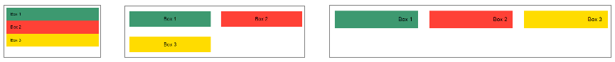

<!-- .element: class="center" -->


### CSS transition and animation

<iframe height='320' scrolling='no' title='Css3 Spinners' src='//codepen.io/huckbit/embed/RRmyzY/?height=265&theme-id=light&default-tab=result&embed-version=2' frameborder='no' allowtransparency='true' allowfullscreen='true' style='width: 100%;'>See the Pen <a href='https://codepen.io/huckbit/pen/RRmyzY/'>Css3 Spinners</a> by Massimiliano Ranauro (<a href='https://codepen.io/huckbit'>@huckbit</a>) on <a href='https://codepen.io'>CodePen</a>.
</iframe>

- http://easings.net/ (easing functions)
- https://developer.mozilla.org/en-US/docs/Web/CSS/CSS_Animations/Using_CSS_animations


# CSS Frameworks

<br/>

* don't reinvent the wheel
* use best practices
* get reusable components
* design oriented


### [Bootstrap](http://getbootstrap.com/)


<!-- .element: class="top right" -->

One framework, every device

**CSS**

Global CSS settings, fundamental HTML elements styled and enhanced with extensible classes, and an advanced grid system.
<!-- .element: class="smaller" -->

**Components**

Over a dozen reusable components built to provide iconography, dropdowns, input groups, navigation, alerts, and much more.
<!-- .element: class="smaller" -->

**Javascript**

Bring Bootstrap's components to life with over a dozen custom jQuery plugins. Easily include them all, or one by one. Or native javascript if using Boostrap.native.
<!-- .element: class="smaller" -->

Note:

Alternatives: Bootstrap, Foundation, Material Design libraries, UIKit, ...


#### Grid system

```html
<!DOCTYPE html>
<html>
<head>
	<meta charset="utf-8">
	 <link
      href="https://cdn.jsdelivr.net/npm/bootstrap@5.3.2/dist/css/bootstrap.min.css"
      rel="stylesheet"
      crossorigin="anonymous"
    />
	<title>Jumbotron Template for Bootstrap</title>
</head>
<body>
	<h1>Classic Bootstrap</h1>
	<div class="container-fluid">
		<div class="row">
			<div class="col-4">col-4</div>
			<div class="col-4">col-4</div>
			<div class="col-4">col-4</div>
		</div>
		<div class="row">
			<div class="offset-2 col-8">offset-2 col-8</div>
		</div>
		<div class="row">
			<div class="col-md-4">col-md-4</div>
			<div class="col-md-4">col-md-4</div>
			<div class="col-md-4">col-md-4</div>
		</div>
	</div>
	<h1>New Auto Layout</h1>
	<div class="container-fluid">
		<div class="row">
			<div class="col">Col</div>
			<div class="col">Col</div>
		</div>
		<div class="row">
			<div class="col">Col</div>
			<div class="col">Col</div>
			<div class="col">Col</div>
			<div class="col">Col</div>

			<div class="col">Col</div>
		</div>
		<div class="row">
			<div class="col">Col</div>
			<div class="col">Col</div>
			<div class="col-md-8">col-md-8</div>
			<div class="col">Col</div>
		</div>
		<div class="row">
			<div class="col">Col</div>
			<div class="col">Col</div>
			<div class="col-md-auto">col-md-auto</div>
			<div class="col">Col</div>
		</div>
	</div>
</body>
</html>
```
```css
.row > div {
  background-color: #9575CD;
  height: 100px;
  border: 2px solid #333;
  text-align: center;
  line-height: 90px;
  font-size: 20px;
  font-weight: bold;
}
.row {
  margin: 20px 0;
}
```
<!-- .element: class="hide" -->

[https://getbootstrap.com/docs/5.3/layout/grid/](https://getbootstrap.com/docs/5.3/layout/grid/)

<!-- .element: class="credits" -->


```html
<!doctype html>
<html lang="en">

<head>
	<meta charset="utf-8">
	<meta name="viewport" content="width=device-width, initial-scale=1">
	<meta name="description" content="">
	<meta name="author" content="Mark Otto, Jacob Thornton, and Bootstrap contributors">
	<meta name="generator" content="Hugo 0.88.1">
	<title>Carousel Template · Bootstrap v5.3</title>

	<link rel="canonical" href="https://getbootstrap.com/docs/5.3/examples/carousel/">

	<!-- Bootstrap core CSS -->
	 <link
      href="https://cdn.jsdelivr.net/npm/bootstrap@5.3.2/dist/css/bootstrap.min.css"
      rel="stylesheet"
      crossorigin="anonymous"
    />

	<!-- Favicons -->
	<link rel="apple-touch-icon" href="https://getbootstrap.com/docs/5.1/assets/img/favicons/apple-touch-icon.png" sizes="180x180">
	<link rel="icon" href="https://getbootstrap.com/docs/5.1/assets/img/favicons/favicon-32x32.png" sizes="32x32" type="image/png">
	<link rel="icon" href="https://getbootstrap.com/docs/5.1/assets/img/favicons/favicon-16x16.png" sizes="16x16" type="image/png">
	<link rel="manifest" href="https://getbootstrap.com/docs/5.1/assets/img/favicons/manifest.json">
	<link rel="mask-icon" href="https://getbootstrap.com/docs/5.1/assets/img/favicons/safari-pinned-tab.svg" color="#7952b3">
	<link rel="icon" href="https://getbootstrap.com/docs/5.1/assets/img/favicons/favicon.ico">
	<meta name="theme-color" content="#7952b3">

	<style>
		.bd-placeholder-img {
			font-size: 1.125rem;
			text-anchor: middle;
			-webkit-user-select: none;
			-moz-user-select: none;
			user-select: none;
		}

		@media (min-width: 768px) {
			.bd-placeholder-img-lg {
				font-size: 3.5rem;
			}
		}
	</style>

	<!-- Custom styles for this template -->
	<link href="https://getbootstrap.com/docs/5.3/examples/carousel/carousel.css" rel="stylesheet">
</head>

<body>
	<header>
		<nav class="navbar navbar-expand-md navbar-dark fixed-top bg-dark">
			<div class="container-fluid">
				<a class="navbar-brand" href="#">Carousel</a>
				<button class="navbar-toggler" type="button" data-bs-toggle="collapse" data-bs-target="#navbarCollapse" aria-controls="navbarCollapse" aria-expanded="false" aria-label="Toggle navigation">
        <span class="navbar-toggler-icon"></span>
      </button>
				<div class="collapse navbar-collapse" id="navbarCollapse">
					<ul class="navbar-nav me-auto mb-2 mb-md-0">
						<li class="nav-item">
							<a class="nav-link active" aria-current="page" href="#">Home</a>
						</li>
						<li class="nav-item">
							<a class="nav-link" href="#">Link</a>
						</li>
						<li class="nav-item">
							<a class="nav-link disabled">Disabled</a>
						</li>
					</ul>
					<form class="d-flex">
						<input class="form-control me-2" type="search" placeholder="Search" aria-label="Search">
						<button class="btn btn-outline-success" type="submit">Search</button>
					</form>
				</div>
			</div>
		</nav>
	</header>

	<main>
		<div id="myCarousel" class="carousel slide" data-bs-ride="carousel">
			<div class="carousel-indicators">
				<button type="button" data-bs-target="#myCarousel" data-bs-slide-to="0" class="active" aria-current="true" aria-label="Slide 1"></button>
				<button type="button" data-bs-target="#myCarousel" data-bs-slide-to="1" aria-label="Slide 2"></button>
				<button type="button" data-bs-target="#myCarousel" data-bs-slide-to="2" aria-label="Slide 3"></button>
			</div>
			<div class="carousel-inner">
				<div class="carousel-item active">
					<svg class="bd-placeholder-img" width="100%" height="100%" xmlns="http://www.w3.org/2000/svg"
						aria-hidden="true" preserveAspectRatio="xMidYMid slice" focusable="false">
						<rect width="100%" height="100%" fill="#777" /></svg>

					<div class="container">
						<div class="carousel-caption text-start">
							<h1>Example headline.</h1>
							<p>Some representative placeholder content for the first slide of the carousel.</p>
							<p><a class="btn btn-lg btn-primary" href="#">Sign up today</a></p>
						</div>
					</div>
				</div>
				<div class="carousel-item">
					<svg class="bd-placeholder-img" width="100%" height="100%" xmlns="http://www.w3.org/2000/svg"
						aria-hidden="true" preserveAspectRatio="xMidYMid slice" focusable="false">
						<rect width="100%" height="100%" fill="#777" /></svg>

					<div class="container">
						<div class="carousel-caption">
							<h1>Another example headline.</h1>
							<p>Some representative placeholder content for the second slide of the carousel.</p>
							<p><a class="btn btn-lg btn-primary" href="#">Learn more</a></p>
						</div>
					</div>
				</div>
				<div class="carousel-item">
					<svg class="bd-placeholder-img" width="100%" height="100%" xmlns="http://www.w3.org/2000/svg"
						aria-hidden="true" preserveAspectRatio="xMidYMid slice" focusable="false">
						<rect width="100%" height="100%" fill="#777" /></svg>

					<div class="container">
						<div class="carousel-caption text-end">
							<h1>One more for good measure.</h1>
							<p>Some representative placeholder content for the third slide of this carousel.</p>
							<p><a class="btn btn-lg btn-primary" href="#">Browse gallery</a></p>
						</div>
					</div>
				</div>
			</div>
			<button class="carousel-control-prev" type="button" data-bs-target="#myCarousel" data-bs-slide="prev">
      <span class="carousel-control-prev-icon" aria-hidden="true"></span>
      <span class="visually-hidden">Previous</span>
    </button>
			<button class="carousel-control-next" type="button" data-bs-target="#myCarousel" data-bs-slide="next">
      <span class="carousel-control-next-icon" aria-hidden="true"></span>
      <span class="visually-hidden">Next</span>
    </button>
		</div>

		<!-- Marketing messaging and featurettes
  ================================================== -->
		<!-- Wrap the rest of the page in another container to center all the content. -->

		<div class="container marketing">

			<!-- Three columns of text below the carousel -->
			<div class="row">
				<div class="col-lg-4">
					<svg class="bd-placeholder-img rounded-circle" width="140" height="140"
						xmlns="http://www.w3.org/2000/svg" role="img" aria-label="Placeholder: 140x140"
						preserveAspectRatio="xMidYMid slice" focusable="false">
						<title>Placeholder</title>
						<rect width="100%" height="100%" fill="#777" /><text x="50%" y="50%" fill="#777"
							dy=".3em">140x140</text>
					</svg>

					<h2>Heading</h2>
					<p>Some representative placeholder content for the three columns of text below the carousel. This is
						the first column.</p>
					<p><a class="btn btn-secondary" href="#">View details &raquo;</a></p>
				</div><!-- /.col-lg-4 -->
				<div class="col-lg-4">
					<svg class="bd-placeholder-img rounded-circle" width="140" height="140"
						xmlns="http://www.w3.org/2000/svg" role="img" aria-label="Placeholder: 140x140"
						preserveAspectRatio="xMidYMid slice" focusable="false">
						<title>Placeholder</title>
						<rect width="100%" height="100%" fill="#777" /><text x="50%" y="50%" fill="#777"
							dy=".3em">140x140</text>
					</svg>

					<h2>Heading</h2>
					<p>Another exciting bit of representative placeholder content. This time, we've moved on to the
						second column.</p>
					<p><a class="btn btn-secondary" href="#">View details &raquo;</a></p>
				</div><!-- /.col-lg-4 -->
				<div class="col-lg-4">
					<svg class="bd-placeholder-img rounded-circle" width="140" height="140"
						xmlns="http://www.w3.org/2000/svg" role="img" aria-label="Placeholder: 140x140"
						preserveAspectRatio="xMidYMid slice" focusable="false">
						<title>Placeholder</title>
						<rect width="100%" height="100%" fill="#777" /><text x="50%" y="50%" fill="#777"
							dy=".3em">140x140</text>
					</svg>

					<h2>Heading</h2>
					<p>And lastly this, the third column of representative placeholder content.</p>
					<p><a class="btn btn-secondary" href="#">View details &raquo;</a></p>
				</div><!-- /.col-lg-4 -->
			</div><!-- /.row -->


			<!-- START THE FEATURETTES -->

			<hr class="featurette-divider">

			<div class="row featurette">
				<div class="col-md-7">
					<h2 class="featurette-heading">First featurette heading.
						<span class="text-muted">It’ll blow your mind.</span></h2>
					<p class="lead">Some great placeholder content for the first featurette here. Imagine some exciting
						prose here.</p>
				</div>
				<div class="col-md-5">
					<svg class="bd-placeholder-img bd-placeholder-img-lg featurette-image img-fluid mx-auto" width="500"
						height="500" xmlns="http://www.w3.org/2000/svg" role="img" aria-label="Placeholder: 500x500"
						preserveAspectRatio="xMidYMid slice" focusable="false">
						<title>Placeholder</title>
						<rect width="100%" height="100%" fill="#eee" /><text x="50%" y="50%" fill="#aaa"
							dy=".3em">500x500</text>
					</svg>

				</div>
			</div>

			<hr class="featurette-divider">

			<div class="row featurette">
				<div class="col-md-7 order-md-2">
					<h2 class="featurette-heading">Oh yeah, it’s that good.
						<span class="text-muted">See for yourself.</span></h2>
					<p class="lead">Another featurette? Of course. More placeholder content here to give you an idea of
						how this layout would work with some actual real-world content in place.</p>
				</div>
				<div class="col-md-5 order-md-1">
					<svg class="bd-placeholder-img bd-placeholder-img-lg featurette-image img-fluid mx-auto" width="500"
						height="500" xmlns="http://www.w3.org/2000/svg" role="img" aria-label="Placeholder: 500x500"
						preserveAspectRatio="xMidYMid slice" focusable="false">
						<title>Placeholder</title>
						<rect width="100%" height="100%" fill="#eee" /><text x="50%" y="50%" fill="#aaa"
							dy=".3em">500x500</text>
					</svg>

				</div>
			</div>

			<hr class="featurette-divider">

			<div class="row featurette">
				<div class="col-md-7">
					<h2 class="featurette-heading">And lastly, this one. <span class="text-muted">Checkmate.</span></h2>
					<p class="lead">And yes, this is the last block of representative placeholder content. Again, not
						really intended to be actually read, simply here to give you a better view of what this would
						look like with some actual content. Your content.</p>
				</div>
				<div class="col-md-5">
					<svg class="bd-placeholder-img bd-placeholder-img-lg featurette-image img-fluid mx-auto" width="500"
						height="500" xmlns="http://www.w3.org/2000/svg" role="img" aria-label="Placeholder: 500x500"
						preserveAspectRatio="xMidYMid slice" focusable="false">
						<title>Placeholder</title>
						<rect width="100%" height="100%" fill="#eee" /><text x="50%" y="50%" fill="#aaa"
							dy=".3em">500x500</text>
					</svg>

				</div>
			</div>

			<hr class="featurette-divider">

			<!-- /END THE FEATURETTES -->

		</div><!-- /.container -->


		<!-- FOOTER -->
		<footer class="container">
			<p class="float-end"><a href="#">Back to top</a></p>
			<p>&copy; 2017–2021 Company, Inc. &middot; <a href="#">Privacy</a> &middot; <a href="#">Terms</a></p>
		</footer>
	</main>

	<script src="https://getbootstrap.com/docs/5.1/dist/js/bootstrap.bundle.min.js" crossorigin="anonymous">
	</script>

</body>
</html>
```


### Beyond Frameworks, Design Guidelines

- Google:  [Material Design](https://material.io/guidelines/)
- Microsoft: [Fluent Design System](http://fluent.microsoft.com/)


# Exercices

<!-- .element: class="text-white" -->

<!-- .slide: data-background-image="images/background_code.webp" -->

## [CSS Bootstrap](https://github.com/bfritscher/cours-html-exercices/tree/master/CSS_Bootstrap)
<!-- .element: class="text-white" -->


### Références supplémentaires

* http://caniuse.com/
* https://developer.mozilla.org/fr/docs/Web/HTML/Element
* https://developer.mozilla.org/fr/docs/Web/Guide/HTML/Formulaires/Les_blocs_de_formulaires_natifs
* http://tympanus.net/codrops/css_reference/
* https://developer.mozilla.org/fr/docs/Web/CSS/Reference
* http://www.w3.org/Style/css3-selectors-updates/WD-css3-selectors-20010126.fr.html
* http://css.sutterlity.fr/
* http://fr.learnlayout.com/
* https://developer.mozilla.org/fr/docs/CSS/Premiers_pas
