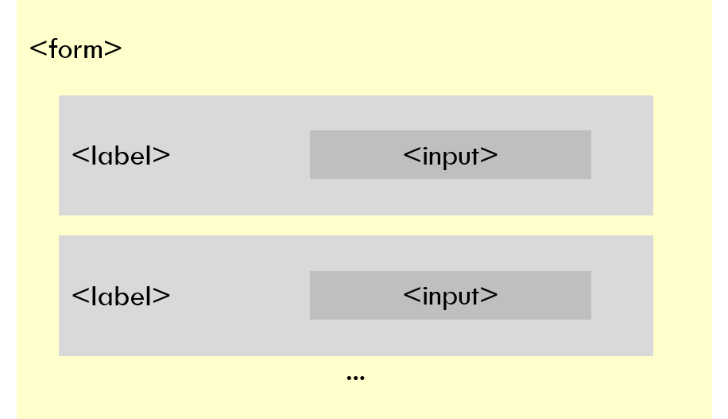
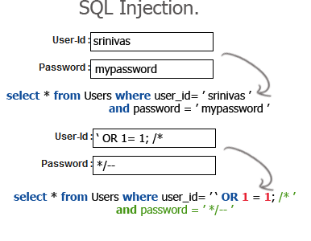

64-31.1 Projet de technologie web
<!-- .element: style="font-size:0.7em;margin:4em 0;" -->

# HTML


<!-- .element: style="position:absolute; top:0; left:0;width:40%;" class="nopdf" -->


<!-- .element: style="position:absolute; top:0; right:0;width:10%;" class="nopdf" -->

[Boris.Fritscher@he-arc.ch](mailto:Boris.Fritscher@he-arc.ch)
<!-- .element: class="bottom left nopdf" -->

## Formulaires


### HTML `<form>`

`<form>` sert à préparer un ensemble de données de l'utilisateur, et les envoyer au serveur,
chaque donnée est saisie dans une paire d'éléments `<label>` et `<input>`
exemple simple:


<!-- .element: class="w-50" -->

<!-- .element: class="center" -->


### HTML `<form>`

```html
<form action="https://ptsv2.com./t/heg/post" method="post">
    <label>Ville: <input name="city_name"/></label> <br/>
    <label>Pays: <input name="country_name"/></label> <br/>
    <input type="submit" value="Envoyer"/>
</form>
```

<!-- .element: class="html-preview output-right output-w-30" -->

L'attribut **`action`** définit l'emplacement (une URL) où doivent être envoyées les données collectées par le formulaire.

L'attribut **`method`** définit la méthode HTTP utilisée pour envoyer les données (cela peut être « *`get`* » ou « *`post`* »).

https://developer.mozilla.org/fr/docs/Web/Guide/HTML/Formulaires/Mon_premier_formulaire_HTML

<!-- .element: class="credits" -->


#### Composition d'un formulaire HTML: la palette des éléments

<table>
  <tr>
    <td>Champs de saisie</td>
    <td>
      <label><input type="text" name="nom"/></label> <br/>
      <label><input type="password" name="password" value="12345678"/></label>
    </td>
  </tr>
  <tr>
    <td>Boîtes à cocher</td>
    <td>
      <div style="display:flex;">
        <div style="flex:1">
        <label>
          <input type="checkbox" name="v" value ="voiture"/>
          Voiture
        </label> <br/>
        <label>
          <input type="checkbox" name="v" value="train" checked="checked"/>
          Train
        </label> <br/>
        <label>
          <input type="checkbox" name="v" value="velo"/>
          Vélo
        </label>
        </div>
        <div style="flex:1">
        <label>
          <input type="radio" name="contact" value ="email"/>
          Email
        </label> <br/>
        <label>
          <input type="radio" name="contact" value="telephone"/> Téléphone
        </label> <br/>
        <label>
          <input type="radio" name="contact" value="courrier" checked="checked"/>
          Courrier
        </label>
        </div>
      </div>
    </td>
  </tr>
  <tr>
    <td style="vertical-align:top">Champ multi-lignes</td>
    <td>
      <textarea cols="30" rows="4" name="comment"></textarea>
    </td>
  </tr>
  <tr>
    <td>Liste déroulante de valeurs</td>
    <td style="vertical-align:top">
      <label>
        <select name="pet">
          <option value="dog">Chien</option>
          <option value="cat" selected>Chat</option>
          <option value="hamster">Hamster</option>
        </select>
      </label>
      <label>
        <select name="pet" size="3">
          <option value="dog">Chien</option>
          <option value="cat" selected>Chat</option>
          <option value="hamster">Hamster</option>
        </select>
      </label>
    </td>
  </tr>
  <tr>
    <td>Boutons à cliquer</td>
    <td>
    <input type="submit" name="save1" value="Sauver"/> <br />
  Envoyer le formulaire <input type="image"  name="save2"
    src="images/save-solid.svg" alt="Sauver" />
    </td>
  </tr>
</table>
<!-- .element: class="w-80" -->

https://developer.mozilla.org/fr/docs/Web/Guide/HTML/Formulaires/Les_blocs_de_formulaires_natifs
<!-- .element: class="credits" -->


### HTML Form `disabled`

Tous les élements peuvent être desactivé avec l'attribut `disabled`
<!-- .element: class="smaller" -->

```html
<input type="text" value="Alice" disabled> <br/>
<input type="button" value="Sauver" disabled>
```
<!-- .element: class="html-preview output-right output-w-20" -->


### Elément `<input type="text">`

Champs de saisie avec du texte sur une seule ligne.

| Attribut | Description
| -------- | --------------------------------------------
| name     | le nom de la variable envoyée au serveur.
| value	   | la valeur par défaut.
| placeholder | exemple qui sera affichée lorsqu'aucune valeur n'est saisie.


```html
<label>Nom: <input type="text" name="nom"/></label> <br/>
<label>Prénom: <input type="text"
                      placeholder="Alice"
                      name="prenom"/></label> <br/>
<label>Ville: <input type="text"
                     name="city"
                     value="Neuchâtel" /></label>
```
<!-- .element: class="html-preview output-right output-w-30" -->

[https://developer.mozilla.org/fr/docs/Web/HTML/Element/input/text](https://developer.mozilla.org/fr/docs/Web/HTML/Element/input/text)

<!-- .element: class="credits" -->


### Elément `<input type="password">`

Saisir un mot de passe sans que celui-ci ne soit lisible à l'écran

```html
<label>
  Mot de passe: <input type="password"
                            name="password"
                            value="12345678" />
</label>
```
<!-- .element: class="html-preview output-right output-w-33" -->

[https://developer.mozilla.org/fr/docs/Web/HTML/Element/input/password](https://developer.mozilla.org/fr/docs/Web/HTML/Element/input/password)

<!-- .element: class="credits" -->


### Elément `<input type="checkbox">`

pour saisir un choix de valeurs parmi plusieurs valeurs

<!-- .element: class="small" -->

| Attribut | Description
| -------- | --------------------------------------------
| name     | le nom de la variable envoyée au serveur.
| value	   | la valeur envoyée au serveur si la case est cochée.
| checked	 | si présent, la case à cocher sera cochée.


```html
<label>
  <input type="checkbox" name="v" value ="voiture"/>
  Voiture Individuelle
</label> <br/>
<label>
  <input type="checkbox" name="v" value="train" checked="checked"/>
  Train ou tram
</label> <br/>
<label>
  <input type="checkbox" name="v" value="velo"/>
  Vélo ou trottinnette
</label>
```

<!-- .element: class="html-preview output-right output-w-30" -->

[https://developer.mozilla.org/fr/docs/Web/HTML/Element/input/checkbox](https://developer.mozilla.org/fr/docs/Web/HTML/Element/input/checkbox)

<!-- .element: class="credits" -->


### Elément `<input type="radio">`

pour saisir un choix **unique** parmi plusieurs valeurs

<!-- .element: class="small" -->

| Attribut | Description
| -------- | --------------------------------------------
| name     | le nom de la variable envoyée au serveur.
| value	   | la valeur envoyée au serveur si la case est cochée.
| checked	 | si présent, la case à cocher sera cochée.

<!-- .element: class="smaller" -->

Important même `name` pour connecter les inputs

<!-- .element: class="warn smaller" -->

```html
<label>
  <input type="radio" name="contact" value ="email"/>
   Email
</label> <br/>
<label>
  <input type="radio" name="contact" value="telephone"/> Téléphone
</label> <br/>
<label>
  <input type="radio" name="contact" value="courrier" checked="checked"/>
  Courrier
</label>
```

<!-- .element: class="html-preview output-right output-w-30" -->

[https://developer.mozilla.org/fr/docs/Web/HTML/Element/input/radio](https://developer.mozilla.org/fr/docs/Web/HTML/Element/input/radio)

<!-- .element: class="credits" -->


### Elément `<textarea>`

Espace de saisie de plusieurs lignes de texte


<!-- .element: class="small" -->

| Attribut | Description
| -------- | --------------------------------------------
| name     | le nom de la variable envoyée au serveur.
| cols	   | la largeur visible du contrôle de saisie.
| rows     | le nombre de lignes de texte visibles pour le contrôle.


```html
<label>
  Commentaire:<br/>
  <textarea cols="30" rows="4" name="comment"></textarea>
</label>
<label>
  Recette:<br/>
  <textarea cols="20" rows="3" name="recette">1. Préparer
2.
3.</textarea>
</label>
```

<!-- .element: class="html-preview output-right output-w-30" -->

[https://developer.mozilla.org/fr/docs/Web/HTML/Element/textarea](https://developer.mozilla.org/fr/docs/Web/HTML/Element/textarea)

<!-- .element: class="credits" -->


### Elément `<select> <option>`

Liste déroulante de valeurs à choisir

<!-- .element: class="small" -->

| Attribut | Description
| -------- | --------------------------------------------
| name     | le nom de la variable envoyée au serveur.
| value	   | la valeur envoyée au serveur si l'option est selectionnée.
| selected | l'option sera selectionnée


```html
<label>Choisir un animal :
  <select name="pet">
    <option value="dog">Chien</option>
    <option value="cat" selected>Chat</option>
    <option value="hamster">Hamster</option>
  </select>
</label>
```

<!-- .element: class="html-preview output-right output-w-30" -->

[https://developer.mozilla.org/fr/docs/Web/HTML/Element/select](https://developer.mozilla.org/fr/docs/Web/HTML/Element/select)

<!-- .element: class="credits" -->


### Elément `<select> <optgroup>`

Liste déroulante de valeurs à choisir


<!-- .element: class="small" -->

| Attribut | Description
| -------- | --------------------------------------------
| multiple | si présent, la sélection multiple est possible.
| size | Nombres de lignes affiché en mode liste.


```html

<label>Veuillez choisir un ou plusieurs animaux: <br/>
  <select name="pets" multiple size="10">
    <optgroup label="Animaux à 4-jambes">
      <option value="Chien">Chien</option>
      <option value="chat">Chat</option>
      <option value="hamster" disabled>Hamster</option>
    </optgroup>
    <optgroup label="Animaux volants">
      <option value="perroquet">Perroquet</option>
      <option value="macaw">Macaw</option>
      <option value="albatros">Albatros</option>
    </optgroup>
  </select>
</label>
```

<!-- .element: class="html-preview output-right output-w-20" -->

[https://developer.mozilla.org/fr/docs/Web/HTML/Element/select](https://developer.mozilla.org/fr/docs/Web/HTML/Element/select)

<!-- .element: class="credits" -->


### Elément `<input type="submit">`

bouton qui provoque l'envoi des données du formulaire

| Attribut | Description
| -------- | --------------------------------------------
| value	   | texte affiché sur le bouton.


on peut aussi utiliser une image/icône comme bouton:
un même formulaire peut avoir plusieurs "submit buttons",
chacun portant un nom différent.
<!-- .element: class="small" -->

```html
<form action="https://ptsv2.com./t/heg/post">
  <input type="submit" name="save1" value="Sauver"/> <br />
  Envoyer le formulaire <input type="image"  name="save2"
    src="images/save-solid.svg" alt="Sauver" />
</form>
```
<!-- .element: class="html-preview output-right output-w-30" -->


[https://developer.mozilla.org/fr/docs/Web/HTML/Element/input/submit](https://developer.mozilla.org/fr/docs/Web/HTML/Element/input/submit)

<!-- .element: class="credits" -->


### Elément `<button>`

bouton qui provoque l'envoi des données du formulaire

| Attribut | Description
| -------- | --------------------------------------------
| type	   | submit, reset ou button

```html
<form action="https://ptsv2.com./t/heg/post">
  <label>Nom: <input type="text" name="nom"/><br/>

  <button type="button">ne fait rien</button><br/>

  <button type="submit">Envoyer
    
  </button>

  <button type="reset">Effacer</button>
</form>
```
<!-- .element: class="html-preview output-right output-w-30" -->

[https://developer.mozilla.org/fr/docs/Web/HTML/Element/button](https://developer.mozilla.org/fr/docs/Web/HTML/Element/button)

<!-- .element: class="credits" -->


### Elément `<input type="hidden">`

Transmettre avec les données du formulaires des données supplémentaires non affichées sur la page.


<!-- .element: class="small" -->

| Attribut | Description
| -------- | --------------------------------------------
| name     | le nom de la variable envoyée au serveur.
| value	   | la valeur envoyée au serveur si la case est cochée.


```html
<input type="hidden" name="session_id" value ="ab324e23"/>
```

Méthode très utilisée pour reprendre des données saisies ou connues précédemment pour le prochain formulaire, dans le cas d'une suite de formulaires pour un même traitement.
<!-- .element: class="small" -->

Exemple: Achat sur un Web Shop, le numéro de la commande n'est pas saisi par l'utilisateur, mais il est fabriqué par le serveur et repassé en "hidden" de formulaires en formulaires jusqu'au formulaire final de paiement.
<!-- .element: class="smaller" -->

[https://developer.mozilla.org/fr/docs/Web/HTML/Element/input/checkbox](https://developer.mozilla.org/fr/docs/Web/HTML/Element/input/checkbox)

<!-- .element: class="credits" -->


### Exemple de formulaire complet

```html
<h3>Devenz membre de notre association:</h3>
<form method="get"
      action="https://ptsv2.com./t/heg/post">
  <p>
    <label>Nom: <input type="text" name="nom"/></label>
  </p>
  <p>
    <label>Prénom: <input type="text" name="prenom"/></label>
  </p>
  <p>
    <label>e-Mail: <input type="text" name="eMail"/></label>
  </p>
  <p>
    <label>Pays:
      <select name="pays">
        <option value="suisse"
                selected="selected">Suisse</option>
        <option value="allemagne">Allemagne</option>
        <option value="france">France</option>
        <option value="etatsunis">&Eacute;tats-Unis</option>
      </select>
    </label>
  </p>
  <p>
    <label>Date de naissance:
      <input name="dateNaissance"
              maxlength="10" size="10" />
    </label>
  </p>
  <p>
    <label>
      <input type="radio"
              name="categorie"
              value="Actif"
              checked="checked" /> Membre Actif
    </label>
    <br />
    <label>
      <input type="radio"
              name="categorie"
              value="Soutien" /> Membre Soutien
    </label>
    <br />
    <label>
      <input type="radio"
              name="categorie"
              value="Fourchette" /> Section Fourchette
    </label>
  </p>
  <p>
    <input type="submit" value="S'inscrire" />
  </p>
</form>
```

<!-- .element: class="html-preview output-right output-w-33" -->


### Regroupements d'éléments `<fieldset>`

Structurer des éléments d’un formulaire en sous-groupes

```html
<fieldset>
  <legend>titre pour le groupe</legend>
      <label><input name="..." /></label>
       ... champs ou boutons du formulaire ...
</fieldset>
```
https://developer.mozilla.org/fr/docs/Web/Guide/HTML/Formulaires/Comment_structurer_un_formulaire_HTML

<!-- .element: class="credits" -->


### Exemple de formulaire complet - fieldsets

```html
<h3>Devenz membre de notre association:</h3>
<form method="post"
      action="https://ptsv2.com./t/heg/post"
      enctype="multipart/form-data">
  <fieldset>
    <legend>Données personnelles</legend>
    <p>
      <label>Nom: <input type="text" name="nom"/></label>
    </p>
    <p>
      <label>Prénom: <input type="text" name="prenom"/></label>
    </p>
    <p>
      <label>e-Mail: <input type="text" name="eMail"/></label>
    </p>
    <p>
      <label>Pays:
        <select name="pays">
          <option value="suisse"
                  selected="selected">Suisse</option>
          <option value="allemagne">Allemagne</option>
          <option value="france">France</option>
          <option value="etatsunis">&Eacute;tats-Unis</option>
        </select>
      </label>
    </p>
  </fieldset>

  <fieldset id="categorie">
    <legend>Catégorie membre</legend>
    <p>
      <label>Date de naissance:
        <input name="dateNaissance"
               maxlength="10" size="10" />
      </label>
    </p>
    <p>
      <label>
        <input type="radio"
               name="categorie"
               value="Actif"
               checked="checked" /> Membre Actif
      </label>
      <br />
      <label>
        <input type="radio"
               name="categorie"
               value="Soutien" /> Membre Soutien
      </label>
      <br />
      <label>
        <input type="radio"
               name="categorie"
               value="Fourchette" /> Section Fourchette
      </label>
    </p>
  </fieldset>

  <p>
    <label>Photo: <input type="file" name="fichier"></label>
  </p>
  <p>
    <textarea name="comments"
         cols="40"
        rows="4">Entrez ici vos commentaires…</textarea>
  </p>
  <p>
    <input type="submit" value="S'inscrire" />
  </p>
</form>
```
<!-- .element: class="html-preview output-right output-w-33" -->


## HTTP `GET` ou `POST`

**La méthode GET** est utilisée par le navigateur pour demander au serveur de renvoyer une certaine ressource. "Hé le serveur, je veux cette ressource." Dans ce cas, le navigateur envoie un corps vide. Du coup, si un formulaire est envoyé avec cette méthode, les données envoyées au serveur sont ajoutées à l'URL.
<!-- .element: class="small" -->

**La méthode POST** est un peu différente. C'est la méthode que le navigateur utilise pour demander au serveur une réponse prenant en compte les données contenues dans le corps de la requête HTTP : « Hé serveur ! vois ces données et renvoie-moi le résultat approprié ». Si un formulaire est envoyé avec cette méthode, les données sont ajoutées au corps de la requête HTTP.
<!-- .element: class="small" -->

https://developer.mozilla.org/fr/docs/Web/Guide/HTML/Formulaires/Envoyer_et_extraire_les_donn%C3%A9es_des_formulaires
<!-- .element: class="credits" -->


### HTTP `POST`
```
POST / HTTP/1.1
Host: foo.com
Content-Type: application/x-www-form-urlencoded
Content-Length: 13

say=Hi&to=Mom
```

```html
<form method= "post" action="...">
</form>
```

Avantage de la méthode GET (avec les données dans l'URL):
On peut garder un bookmark de l'URL complet (avec données), on peut revenir en arrière sur la même page ("Back"), on peut utiliser cet URL dans un lien Hypertexte (`<a href="…">`)
Remarque: le browser doit encoder certains caractères spéciaux dans l'URL de la requête quand ils font partie des valeurs passées (espaces, accents, etc.)
<!-- .element: class="smaller" -->

Avantage de la méthode POST (avec les données transmises sépa-rément de l'URL):
Si on revient sur le même URL en navigant, on ne risque pas d'insérer une 2e fois les même données dans la base, sauf si on repasse par le formulaire de départ.
Remarque: pour transmettre certaines données (p. ex. fichiers), on est obligé de faire avec la méthode POST.
<!-- .element: class="smaller" -->


### Envoi d'un fichier au serveur

#### `<input type="file">`

```html
<form action="https://ptsv2.com./t/heg/post"
      method="post"
      enctype="multipart/form-data">
  <input type="file"  name="my_file"/>
  <input type="submit" value="Envoyer le fichier"/>
</form>
```
<!-- .element: class="html-preview output-right output-w-33" -->

L'attribut `enctype="multipart/form-data"` est obligatoire dès qu'il y a au moins un fichier dans le formulaire, et la méthode est forcément **`post`**.


# Ne jamais faire confiance aux données reçus des utilisateurs!


### Injection contenu tier

Les attaques Cross-Site Scripting (XSS) et Cross-Site Request Forgery (CSRF) sont des attaques fréquentes qui surviennent quand vous affichez des données renvoyées par un utilisateur à celui-ci ou à un autre utilisateur.

Pour éviter ces attaques, vous devez toujours vérifier les données qu'un utilisateur envoie à votre serveur et (si vous avez besoin de les afficher) essayez de ne pas afficher le contenu HTML tel que fourni par l'utilisateur. A la place, vous devez traiter les données fournies par l'utilisateur afin de ne pas les afficher verbatim.


### Injection SQL

 Cela consiste d'ordinaire à envoyer une requête SQL en espérant que le serveur l'exécutera





### Déni de service

Limitez le volume des données entrantes pour n'autoriser que ce qui est nécessaire.


### Séparation possible entre labels et contrôles

Dans certains cas, on ne peut pas mettre le contrôle `<input>` dans l'élément `<label>` correspondant, à cause des règles d'imbrications des balises. On utilise l'attribut **`for`** pour connecter à un **`id`**.

```html
<div>
  <label for="address">Adresse:</label>
</div>
<div>
  <input id="address" type="text" name="Addr" />
</div>
```


# Exercices

<!-- .element: class="text-white" -->

<!-- .slide: data-background-image="images/background_code.webp" -->

## [HTML Formulaire: Ski Club Bootstrap](https://github.com/bfritscher/cours-html-exercices/tree/master/HTML_Form_SkiClub_Bootstrap)
<!-- .element: class="text-white" -->


### Validation Formulaire

* Champ requis
* Limitation de la taille des entrées
* Validation selon une expression régulière

```html
<form>
  <label>Un mot à 3 lettre
    <input type="text" required minlength="3"
           maxlength="3">
  </label>
  <label>Un mot qui commence par a ?
    <input type="text" required pattern="a.*"><br/>
  </label>
  <label>Combien en voulez‑vous ?
    <input type="number" value="1" min="1" max="10">
  </label>
  <button type="submit">Soumettre</button>
</form>
```
<!-- .element: class="html-preview output-right output-w-33" -->

https://developer.mozilla.org/fr/docs/Web/Guide/HTML/Formulaires/Validation_donnees_formulaire
<!-- .element: class="credits" -->


### Validation Formulaire et CSS

Des pseudo-class `:valid` et `:invalid` sont automatiquement ajoutées aux éléments du formulaire.

```css
input:invalid {
  border: 2px dashed red;
}
input:valid {
  border: 1px solid green;
}
```
<style>
input:invalid {
  border: 2px dashed red;
}
input:valid {
  border: 1px solid green;
}
</style>
```html
<form>
  <label>Un mot à 3 lettre
    <input type="text" required minlength="3"
           maxlength="3">
  </label>
  <label>Un mot qui commence par a ?
    <input type="text" required pattern="a.*"><br/>
  </label>
  <label>Combien en voulez‑vous ?
    <input type="number" value="1" min="1" max="10">
  </label>
  <button type="submit">Soumettre</button>
</form>
```
<!-- .element: class="html-preview output-right output-w-33" -->

https://developer.mozilla.org/fr/docs/Web/Guide/HTML/Formulaires/Validation_donnees_formulaire
<!-- .element: class="credits" -->


