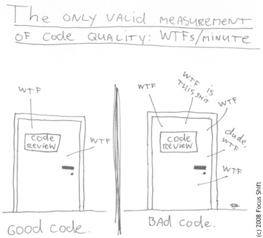
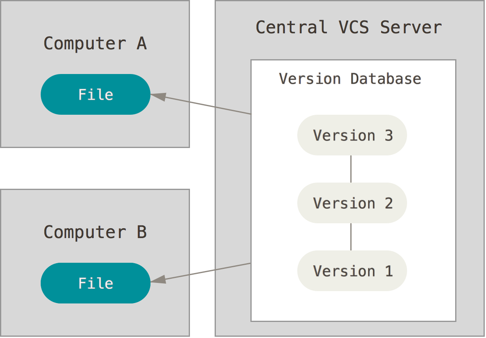
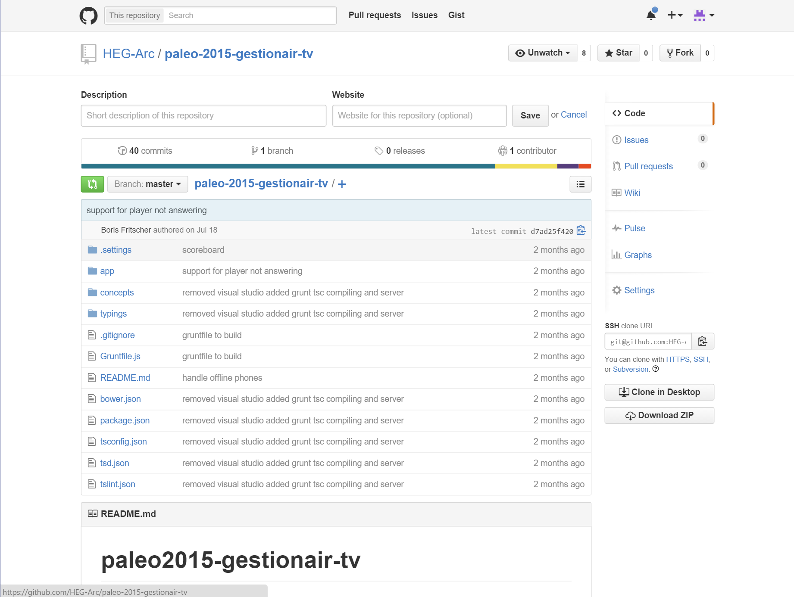
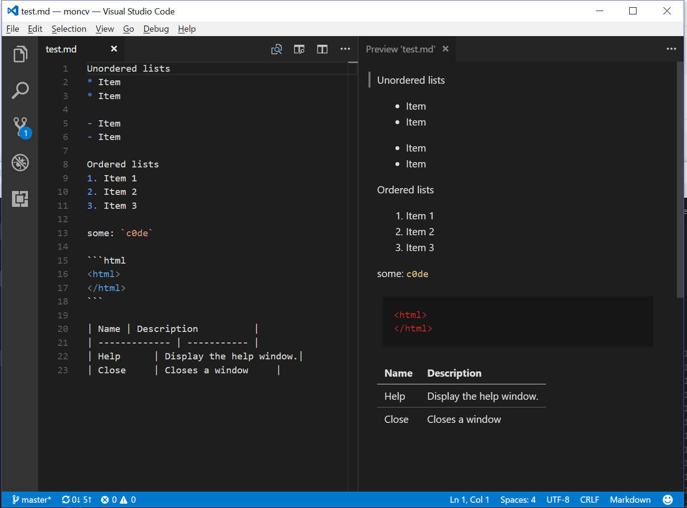

64-31.1 Projet de technologie web
<!-- .element style="font-size:0.7em;margin:4em 0;" -->

# GIT Summary


<!-- .element style="position:absolute; top:0; left:0;width:40%;" class="nopdf" -->


<!-- .element style="position:absolute; top:0; right:0;width:10%;" class="nopdf" -->

[Boris.Fritscher@he-arc.ch](mailto:Boris.Fritscher@he-arc.ch)
<!-- .element style="position:absolute; bottom:20px; left:0;" class="nopdf" -->

#### Part 1: From blank page to deployed website

#### *Tools and git*


# New problems

* Editing code and making backups
* Commenting out code

-> Need for a version control system

<!-- .element: class="bottom right" -->


# Git

Git is a free and open source distributed version control system designed to handle everything from small to very large projects with speed and efficiency.

Download on [git-scm.com](https://git-scm.com/download/win)


### Centralized VCS

<!-- .element: class="w-75" -->

<!-- .element: class="center" -->


### Distributed VCS like Git

<!-- .element: class="w-50" -->

<!-- .element: class="center" -->


### Distributed VCS Advantages

* FAST
* OFFLINE (fix/commit multiple operations)
* Geography
* Flexible Workflows
* Easier Merging
* Implicit Backup
* Scale out, not just up

*Disadvantages: no Locks, Disk space*

http://ericsink.com/vcbe/html/dvcs_advantages.html

<!-- .element: class="credits" -->


### Git basics

* **`git init`** create a new local git repository
* **`git add .`** add all modified and new files to stage
* **`git commit -m 'msg'`** commit staged files with msg
* **`git push`** send commits to remote server
* **`git pull`** download remote commits
* **`git clone`** copy a remote repository
* **`.gitignore`** ignore files or folders


### Git lifecycle


http://git-scm.com/book/en/v2/Git-Basics-Recording-Changes-to-the-Repository

<!-- .element: class="credits" -->


### Ressources

* http://git-scm.com/book/en/v2/Getting-Started-About-Version-Control
* http://rogerdudler.github.io/git-guide/
* http://onlywei.github.io/explain-git-with-d3/#freeplay
* http://pcottle.github.io/learnGitBranching/
* http://git-scm.com/book/en/v2/Git-Basics-Recording-Changes-to-the-Repository


# GitHub

[GitHub](https://github.com/) is a web-based Git repository hosting service, adding
its own features:

Wikis, bug tracking, **Markdown** rendering and static page hosting.

Unlike Git, which is strictly a command-line tool, GitHub provides
a web-based **graphical interface**


### Github Web

Browse commits, issues, fork, pull requests, wiki, Readme.md




### Visual Studio Code Git Support


<!-- .element: class="center" -->

[Documentation](https://code.visualstudio.com/docs/editor/versioncontrol#_git-support)
<!-- .element: class="small" -->


# Do Your Commit Messages Suck?

https://www.youtube.com/watch?v=8YjSty6bfog

<!-- .element: class="center" -->


<iframe width="640" height="480" src="https://www.youtube.com/embed/8YjSty6bfog?rel=0&amp;showinfo=0" frameborder="0" allowfullscreen></iframe>


### Conventional Commits

https://www.conventionalcommits.org/fr/v1.0.0/

* Automatically generating CHANGELOGs.
* Automatically determining a semantic version bump (based on the types of commits landed).
* Communicating the nature of changes to teammates, the public, and other stakeholders.
* Triggering build and publish processes.
* Making it easier for people to contribute to your projects, by allowing them to explore a more structured commit history.

https://github.com/vuejs/vue/blob/dev/.github/COMMIT_CONVENTION.md


# Markdown
## From text to HTML


### Markdown Basics

[Markdown](http://daringfireball.net/projects/markdown/syntax) allows you to write using an easy-to-**read**, easy-to-**write** plain **text format**, which then converts to valid HTML.

```markdown
# The largest heading (an <h1> tag)
## The second largest heading (an <h2> tag)

> Blockquotes

Text styling *italic* and **bold**

Links (<a href="url">title</a>)
[title](url)

Images ()

```


### Markdown List and Table

```markdown
Unordered lists
* Item
* Item

- Item
- Item

Ordered lists
1. Item 1
2. Item 2
3. Item 3

some: `c0de`

| Name | Description          |
| ------------- | ----------- |
| Help      | Display the help window.|
| Close     | Closes a window     |
```
<!-- .element: class="float-left w-50" -->

* Item
* Item

<br/>

1. Item 1
2. Item 2

&nbsp;&nbsp;some: `c0de`

| Name | Description          |
| ------------- | ----------- |
| Help      | Display the help window.|
| Close     | Closes a window     |


### Visual Studio Code

Can preview markdown in realtime.

<!-- .element: class="smaller" -->



<!-- .element: class="w-60" -->

Warning: markdown on github is a special variant!

<!-- .element: class="red" -->

