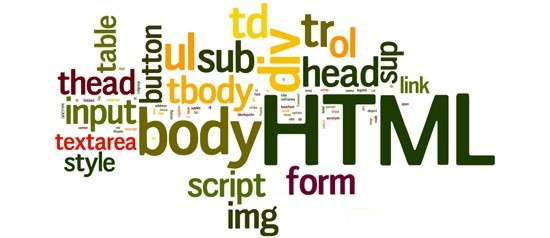
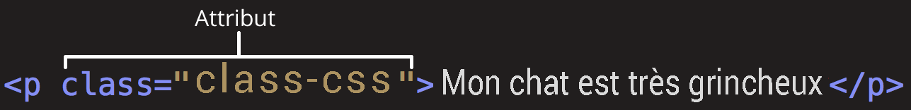
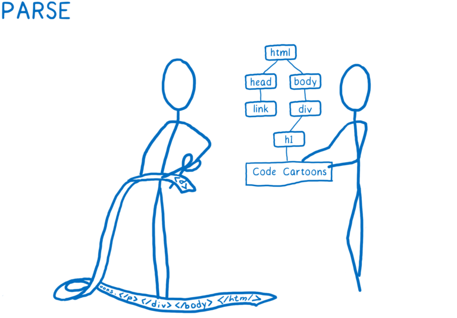
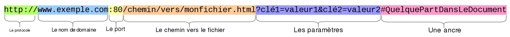
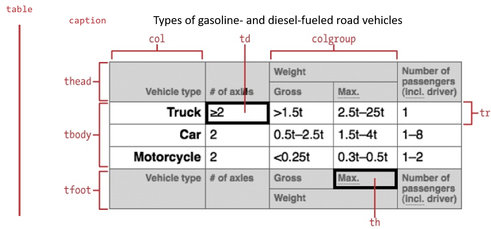

64-31.1 Projet de technologie web

<!-- .element: style="font-size:0.7em;margin:4em 0;" -->

# HTML


<!-- .element: style="position:absolute; top:0; left:0;width:40%;" class="nopdf" -->


<!-- .element: style="position:absolute; top:0; right:0;width:10%;" class="nopdf" -->

[Boris.Fritscher@he-arc.ch](mailto:Boris.Fritscher@he-arc.ch)

<!-- .element: class="bottom left nopdf" -->

## Introduction


# Introduction

Comprendre les briques de bases qui forme les sites web par:



<!-- .element: class="float-left w-40" -->

- des exemples,
- l'apprentissage par la pratique,
- la lecture de ressources en ligne
- et des [quiz](https://marmix.ig.he-arc.ch/poll/)

<!-- .element: class="float-left w-50" -->


### Web et Hypertextes : HTML & HTTP

1990, au CERN à Genève, Tim Berners Lee décide d'utiliser le modèle d'hypertexte pour un système de partage sur Internet de documents entre physiciens. Il développe:

<!-- .element: class="small" -->

- **HTML** (Hypertext Markup Language): pour donner la structure et le contenu des (hyper-)documents,
- **HTTP** (Hypertext Transfer Protocol): le protocole de navigation et communication entre clients (browsers) et serveurs de documents HTML.

6 août 1991: il met à disposition gratuitement les descriptions et les premiers prototypes (1 serveur et l'ancètre des browsers) = **naissance du Web**.

<!-- .element: class="small" -->

https://worldwideweb.cern.ch/


### HTML : évolution

Le web est en perpétuelle évolution, chaque navigateur proposant des améliorations perpétuelles.

Le consortium W3C propose régulièrement des nouvelles versions du standard HTML et CSS.


<!-- .element: class="center" -->


### Trois Langages sont utilisés

- langage de **structure** d'un document (HTML)
- langage de **présentation** de l'information (CSS)
- langage de **validation** et **construction** de données (JavaScript)

Le langage JavaScript permet également d'exprimer des algorithmes complets, pour construire des documents dynamiques, et des traitements de l'information dans un browser web.

<!-- .element: class="small" -->


## Langage informatique

Un langage informatique = **syntaxe** + **sémantique**

**syntaxe:** règles de constitution des phrases correctes du langage.

**sémantique:** règles d’interprétation des phrases du langage par l'ordinateur => effet produit.


## Standard des langages

Documents en ligne qui évoluent!

- HTML [https://www.w3.org/TR/html5/](https://www.w3.org/TR/html5/single-page.html)
- CSS [https://www.w3.org/Style/CSS/](https://www.w3.org/Style/CSS/)
- JavaScript [https://www.ecma-international.org/ecma-262/](https://www.ecma-international.org/ecma-262/)

Souvant technique, donc il est préférable de consulter des guides et des références illustrées comme [Mozilla Developer Network (MDN)](https://developer.mozilla.org/fr/docs/Web)

<!-- .element: class="small" -->

⚠️ Choisir des ressources à jour!

<!-- .element: class="smaller warn" -->


Comment savoir si les règles sont respectées?


## Validateurs W3C

HTML [https://validator.w3.org/](https://validator.w3.org/)

CSS [https://jigsaw.w3.org/css-validator/](https://jigsaw.w3.org/css-validator/)


# HTML
## Hyper Text Markup Language
#### `<html> 🌍 </html>`


### Balises HTML
Une page HTML = un ensemble d’éléments de contenu encadrés par des balises (ou tags en anglais)


<!-- .element: class="center" -->

[MDN - Commencer avec le HTML](https://developer.mozilla.org/fr/docs/Apprendre/HTML/Introduction_%C3%A0_HTML/Getting_started)


### Examples: `<h1>` `<h2>`, `<p>`

Des éléments de titres:
```html
<h1>Apprendre à faire son site</h1>
<h2>Chapitre 1: HTML</h2>
<h3>Les titres</h3>
<h3>Les images</h3>
<h2>Chapitre 2: CSS</h2>
```

<!-- .element: class="html-preview output-right output-w-30" -->
<br/>
<br/>

Un élément paragraphe:
```html
<p>Un texte est composé de
   phrases       regroupées en paragraphes.</p>
<p>Seul le premier espace est compté
  et un
  retour à la ligne est un espace.</p>
```

<!-- .element: class="html-preview output-right output-w-30" -->


### Examples `<br>`, `<hr>`

Un élément peut n'avoir aucun contenu:

Retour à la ligne
```html
<p>Par exemple,<br> pour forcer le retour à la ligne.</p>
```

<!-- .element: class="html-preview output-right output-w-20" -->

Ou une ligne vertical

```html
<p>Du texte ...</p>
<hr>
<p>Autre contenu</p>
```
<!-- .element: class="html-preview output-right output-w-20" -->

Les balises vides peuvent être fermées

`<hr /> <br /> `


### Les attributs des balises

Une balise peut avoir des attributs `nom_attribut="valeur"`:



[MDN - Commencer avec le HTML](https://developer.mozilla.org/fr/docs/Apprendre/HTML/Introduction_%C3%A0_HTML/Getting_started)

<!-- .element: class="credits" -->

```html
<h1 id="un_nom_unique"
    class="warn">Mon titre avec un id</h1>
```

<!-- .element: class="html-preview output-right output-w-30" -->

<br>

id et class existe sur toutes les balises et sont utilisées pour du CSS.

<!-- .element: class="small" -->


### Examples: ``


```html

```

<!-- .element: class="html-preview output-right output-w-20" -->

La balise image doit avoir un attribut:
- `src`: liens vers le fichier image
- `alt`: description de l'image

<!-- .element: class="text-left" -->


https://developer.mozilla.org/fr/docs/Apprendre/HTML/Multimedia_and_embedding/Images_in_HTML

<!-- .element: class="credits" -->


### Imbrication de balises

Un élément peut contenir d'autres éléments imbriqués:
```html
<body>
  <h1>Grumpy Cat</h1>
  <p>
    Littéralement, grumpy cat signifie « chat grincheux »
    
    La première apparition du félin
    sur Internet date du 23 septembre 2012.
  </p>
</body>
```

<!-- .element: class="html-preview output-right output-w-20" -->


### Exemple d'une page


#### Une page `<html>` est une imbrication de balises

```html
<!DOCTYPE html>
<html>
  <head>
    <meta charset="utf-8">
    <title>Rapport d'activité 2010</title>
  </head>
  <body>
      <h1>Rapport d'activité</h1>
      <h2>1. Introduction</h2>
      <p>Cras elementum ultrices diam.
      Maecenas ligula massa, varius a.</p>
     <p>Lorem ipsum dolor sit amet,
        consectetuer adipiscing elit. Sed
        non risus. Suspendisse lectus
        tortor, dignissim sit amet.</p>
      <h2>2. Evolution</h2>
      <p>orem ipsum dolor sit amet,</p>
      <h3>2.1 Stratégie</h3>
      <p>consectetuer adipiscing elit. Sed</p>
  </body>
</html>
```

<!-- .element: class="html-preview output-right output-w-30" -->


#### Une page `<html>` est un arbre d'éléments



https://hacks.mozilla.org/2017/08/inside-a-super-fast-css-engine-quantum-css-aka-stylo/
<!-- .element: class="credits" -->


#### Une page `<html>` est un arbre d'éléments

```html
<!DOCTYPE html>
<html>
  <head>
    <meta charset="utf-8">
    <title>Rapport d'activité 2010</title>
  </head>
  <body>
      <h1>Rapport d'activité</h1>
      <h2>1. Introduction</h2>
      <p>Cras elementum ultrices diam.
      Maecenas ligula massa, varius a.</p>
     <p>Lorem ipsum dolor sit amet,
        consectetuer adipiscing elit. Sed
        non risus. Suspendisse lectus
        tortor, dignissim sit amet.</p>
      <h2>2. Evolution</h2>
      <p>orem ipsum dolor sit amet,</p>
      <h3>2.1 Stratégie</h3>
      <p>consectetuer adipiscing elit. Sed</p>
  </body>
</html>
```

<!-- .element: class="domtree-preview output-right output-w-80 output-h-60" -->


### Listes `<ul>`, `<ol>`, `<li>`

```html
<ul> <!-- unordered list -->
  <li>Banane</li>
  <li>Lait</li> <!-- list item -->
</ul>
```

<!-- .element: class="html-preview output-right output-w-30" -->

```html
<ol> <!-- orderer list -->
  <li>Mettre sur la balance</li>
  <li>Entrer le numéro</li>
</ol>
```

<!-- .element: class="html-preview output-right output-w-30" -->

<style>
.reveal .preview ol[type="A"] {
  list-style-type: lower-alpha;
}
</style>
```html
<ol type="a"> <!-- préférer la propriété CSS list-style-type à la place -->
  <li>Garantie</li>
  <li>Frais</li>
</ol>
```

<!-- .element: class="html-preview output-right output-w-30" -->

https://developer.mozilla.org/fr/docs/Apprendre/HTML/Introduction_%C3%A0_HTML/HTML_text_fundamentals#Listes

<!-- .element: class="credits" -->

https://developer.mozilla.org/fr/docs/Web/HTML/Element/ol

<!-- .element: class="credits" -->


### Listes imbriquées
<style>
.reveal .preview ol ul li{
  list-style-type: disc;
}
</style>
```html
<ol>
  <li>Premier élément</li>
  <li>Deuxième élément  <!-- La balise </li>
                             n'est pas placée ici ! -->
    <ul> <!-- Liste imrbiquée -->
      <li>Premier élément de la liste non-ordonnée imbriquée</li>
      <li>Deuxième élément de la liste non-ordonnée imbriquée</li>
      <li>Troisième élément de la liste non-ordonnée imbriquée</li>
    </ul>

  </li>                 <!-- La balise </li> est ici. -->
  <li>Troisième élément</li>
</ol>
```

<!-- .element: class="html-preview output-right output-w-30" -->


### Listes imbriquées arbre

```html
<ol>
  <li>Premier élément</li>
  <li>Deuxième élément  <!-- La balise </li>
                             n'est pas placée ici ! -->
    <ul> <!-- Liste imrbiquée -->
      <li>Premier élément de la liste non-ordonnée imbriquée</li>
      <li>Deuxième élément de la liste non-ordonnée imbriquée</li>
      <li>Troisième élément de la liste non-ordonnée imbriquée</li>
    </ul>

  </li>                 <!-- La balise </li> est ici. -->
  <li>Troisième élément</li>
</ol>
```

<!-- .element: class="domtree-preview output-right output-w-30 output-h-60" -->


# Exercices

<!-- .element: class="text-white" -->

<!-- .slide: data-background-image="images/background_code.webp" -->

## [HTML Texte: Maestro](https://github.com/bfritscher/cours-html-exercices/tree/master/HTML_Texte_Maestro)
<!-- .element: class="text-white" -->

## [HTML Listes: Crackpie](https://github.com/bfritscher/cours-html-exercices/tree/master/HTML_Listes_Crackpie)
<!-- .element: class="text-white" -->


### Caractères réservés

Certains caractères spéciaux sont réservés pour une utilisation en HTML, ce qui signifie que votre navigateur les analysera en tant que code HTML. Par exemple, si vous utilisez le signe inférieur (<), le navigateur interprète tout texte qui suit comme une balise.

<!-- .element: class="small" -->

<table class="standard-table">
 <thead>
  <tr>
   <th scope="col">Caractère</th>
   <th scope="col">Entité</th>
   <th scope="col">Remarque</th>
  </tr>
 </thead>
 <tbody>
  <tr>
   <td>&amp;</td>
   <td><code>&amp;amp;</code></td>
   <td>Interprété comme le début d'une référence d'entité ou de caractère.</td>
  </tr>
  <tr>
   <td>&lt;</td>
   <td><code>&amp;lt;</code></td>
   <td>Interprété comme le début d'une balise</td>
  </tr>
  <tr>
   <td>&gt;</td>
   <td><code>&amp;gt;</code></td>
   <td>Interprété comme la fin d'une balise</td>
  </tr>
  <tr>
   <td>"</td>
   <td><code>&amp;quot;</code></td>
   <td>Interprété comme le début et la fin d'une valeur d'attributs</td>
  </tr>
 </tbody>
</table>

https://developer.mozilla.org/fr/docs/Glossaire/Entity

<!-- .element: class="credits" -->


## Uniform Resource Locator (URL)




### Hypertext Transfer Protocol (HTTP)

HTTP est un protocole de la couche application. Il peut fonctionner sur n'importe quelle connexion fiable, dans les faits on utilise le protocole TCP comme couche de transport. Un serveur HTTP utilise alors par défaut le port 80 (443 pour HTTPS).
<!-- .element: class="smaller" -->

Requête du client
```
GET /chemin/vers/monfichier.html?clé=valeur&amp; clé2=valeur2 HTTP/1.1
Host: www.exemple.com:80
```

Réponse du serveur
```
HTTP/1.1 200 OK
Date: Wed, 24 Jul 2019 12:52:47 GMT
Server: Apache/2.2.8 (Ubuntu) mod_ssl/2.2.8 OpenSSL/0.9.8g
Content-Type: text/html
Content-Length: 36

<h1>Hello Web</h1>
```
La partie ancre reste côté client.
<!-- .element: class="smaller warn" -->


### URL depuis un fichier HTML

Les fragments nécessaires pour construire une URL fonctionnelle dépendent du contexte dans lequel l'URL est utilisée.
<!-- .element: class="small" -->

**URL relative**

Lorsqu'une URL est utilisée dans un document, on peut utiliser le contexte courrant pour en déduire certaines informations afin de compléter les URL contenues dans le document.
<!-- .element: class="small" -->

**URL absolue**

Si le chemin de l'URL commence par le symbole "/", le navigateur  cherche la ressource à la racine du serveur sans utiliser le contexte du document courant.
<!-- .element: class="small" -->

https://developer.mozilla.org/fr/docs/Apprendre/Comprendre_les_URL
<!-- .element: class="credits" -->


### Exemples URL

Depuis la page suivant: `https://www.site.com/products/sales/july/index.html`
<!-- .element: class="smaller" -->

<table style="font-size: 16px">
  <tbody>
    <tr>
      <th>
        Level
      </th>
      <th>
        Absolute Path (full version)
      </th>
      <th>
        Absolute Path (short version)
      </th>
      <th>
        Relative Path
      </th>
    </tr>
    <tr>
      <td align="right">
        <b>Current</b>
      </td>
      <td>
        https://www.site.com/products/sales/july/
      </td>
      <td>
        /products/sales/july/
      </td>
      <td>
        &nbsp;
      </td>
    </tr>
    <tr>
      <td align="right">
        <b>1 Level Up</b>
      </td>
      <td>
        https://www.site.com/products/sales/summary.html
      </td>
      <td>
        /products/sales/summary.html
      </td>
      <td>
        ../summary.html
      </td>
    </tr>
    <tr>
      <td align="right">
        <b>1 Level Up</b>
      </td>
      <td>
        https://www.site.com/products/sales/services/index.html
      </td>
      <td>
        /products/sales/services/index.html
      </td>
      <td>
        ../services/index.html
      </td>
    </tr>
    <tr>
      <td align="right">
        <b>2 Level Up</b>
      </td>
      <td>
        https://www.site.com/products/demo.html
      </td>
      <td>
        /products/demo.html
      </td>
      <td>
        ../../demo.html
      </td>
    </tr>
    <tr>
      <td align="right">
        <b>2 Level Up</b>
      </td>
      <td>
        https://www.site.com/products/category/index.html
      </td>
      <td>
        /products/category/index.html
      </td>
      <td>
        ../../category/index.html
      </td>
    </tr>
    <tr>
      <td align="right">
        <b>3 Level Up</b>
      </td>
      <td>
        https://www.site.com/index.html
      </td>
      <td>
        /index.html
      </td>
      <td>
        ../../../index.html
      </td>
    </tr>
    <tr>
      <td align="right">
        <b>3 Level Up</b>
      </td>
      <td>
        https://www.site.com/aboutus/index.html
      </td>
      <td>
        /aboutus/index.html
      </td>
      <td>
        ../../../aboutus/index.html
      </td>
    </tr>
    <tr>
      <td align="right">
        <b>1 Level Down</b>
      </td>
      <td>
        https://www.site.com/products/sales/july/images/product1.jpg
      </td>
      <td>
        /products/sales/july/images/product1.jpg
      </td>
      <td>
        images/product1.jpg
      </td>
    </tr>
  </tbody>
</table>

http://www.geeksengine.com/article/absolute-relative-path.html

<!-- .element: class="credits" -->


### HTML Liens `<a>`

| Attribut | Description
| -------- | --------------------------------------------
| href     | une URL absolue ou relative.
| title	   | informations utiles supplémentaires à propos du lien

```html
<p>Plus d'information sur
<a href="https://developer.mozilla.org/fr/docs/Apprendre/HTML/Introduction_%C3%A0_HTML/Creating_hyperlinks"
   title="Page d'information sur les liens">les liens</a>.
</p>
```
<!-- .element: class="html-preview output-right output-w-40" -->

Un lien peut contenir une image
```html
<a href="https://fr.wikipedia.org/wiki/Grumpy_Cat">
  
</a>
```
<!-- .element: class="html-preview output-right output-w-20" -->

https://developer.mozilla.org/fr/docs/Apprendre/HTML/Introduction_%C3%A0_HTML/Creating_hyperlinks
<!-- .element: class="credits text-left" -->

https://developer.mozilla.org/fr/docs/Web/HTML/Element/a
<!-- .element: class="credits text-left" -->


### HTML Liens interne `<a>`

Il est possible de faire un lien vers une partie donnée d'un document HTML (désignée du terme fragment de document), plutôt que juste le haut du document.
Le nom de l'anchre (après le # pointe sur une id qui doit exister dans la page)

```html
<a href="#bas">bas de la page</a>
<br/>
<a href="https://fr.wikipedia.org/wiki/Grumpy_Cat#Produits_d%C3%A9riv%C3%A9s"
   target="_blank">Grumpy Cat</a>
<div class="spacer"></div>
<a id="bas" href="#top">haut de la page</a>
```

https://developer.mozilla.org/fr/docs/Apprendre/HTML/Introduction_%C3%A0_HTML/Creating_hyperlinks

<!-- .element: class="credits" -->


### HTML mailto `<a>`

```html
<a href="mailto:nullepart@mozilla.org?subject=L%27objet%20du%20courriel&body=Le%20corps%20du%20courriel">
  Envoyer un mail avec sujet et corps de message
</a>

```

https://developer.mozilla.org/fr/docs/Web/HTML/Element/a
<!-- .element: class="credits text-left" -->


# Exercices

<!-- .element: class="text-white" -->

<!-- .slide: data-background-image="images/background_code.webp" -->

## [HTML Liens: BlackWhite](https://github.com/bfritscher/cours-html-exercices/tree/master/HTML_Liens_Blackwhite)
<!-- .element: class="text-white" -->


### Tableaux en HTML
Un tableau est un ensemble structuré de données (table de données) présentées en lignes et colonnes.

<!-- .element: class="small" -->

```html
<table>
  <tr> <!-- Tabe Row -->
    <th>Matricule</th> <!-- Tabe Header -->
    <th>Note</th>
  </tr>
  <tr>
    <td>4</td> <!-- Tabe Data -->
    <td>5</td>
  </tr>
  <tr>
    <td>6</td>
    <td>7</td>
  </tr>
</table>
```

<!-- .element: class="html-preview output-right output-w-20" -->

Les tableaux HTML ne doivent être utilisés que pour des données tabulaires! Pas pour de la mise en page de site!

<!-- .element: class="warn small" -->

https://developer.mozilla.org/fr/docs/Apprendre/HTML/Tableaux/Basics

<!-- .element: class="credits" -->


#### Étendre des cellules sur plusieurs lignes ou colonnes

```html
<table>
  <tr>
    <td rowspan="2">A1</td>
    <td>A2</td>
    <td>A3</td>
  </tr>
  <tr>
    <td>B2</td>
    <td>B3</td>
  </tr>
  <tr>
    <td>C1</td>
    <td colspan="2">C2</td>
  </tr>
  <tr><td>D1</td></tr>  <!-- il manque des tds ou colspan -->
  <tr>
    <td>E1</td>
    <td colspan="2">E2</td>
    <td>E3</td>  <!-- td en trop -->
  </tr>
</table>
```

<!-- .element: class="html-preview output-right output-w-20 " -->

Il faut que le compte soit bon! Sion des cellules du tableau vont dépasser

<!-- .element: class="warn small" -->


### Tableaux imbriqués

```html
<table>
  <tr>
    <td>T1</td>
    <td>
      <table>
        <tr>
          <td> A1 </td>
          <td> A2 </td>
        </tr>
        <tr>
          <td> B1 </td>
          <td> <p>Lorem <br>Ipsum</p> </td>
        </tr>
      </table>
    </td>
  </tr>
  <tr>
    <td> <p>Ipsum <br>Lorem</p> </td>
    <td>T4</td>
  </tr>
</table>
```

<!-- .element: class="html-preview output-right output-w-40" -->

https://developer.mozilla.org/fr/docs/Apprendre/HTML/Tableaux/Advanced

<!-- .element: class="credits" -->


### Structure avancée d'un tableaux



[HTML & CSS: The Good Parts](https://proquest.tech.safaribooksonline.de/9781449381943/the_parts_of_a_data_table_html)

<!-- .element: class="credits" -->


### Example: structure avancée d'un tableaux

```html
<table>
  <caption>Types of gasoline- and diesel-fueled road vehicles.</caption>
  <thead>
    <tr>
      <th rowspan="2">Vehicle type</th>
      <th rowspan="2"># of axles</th>
      <th colspan="2">Weight</th>
      <th rowspan="2">Nb pass.</th>
    </tr>
    <tr>
      <th>Gross</th>
      <th>Max.</th>
    </tr>
  </thead>
  <tfoot>
    <tr>
      <th rowspan="2">Vehicle type</th>
      <th rowspan="2"># of axles</th>
      <th>Gross</th>
      <th>Max.</th>
      <th rowspan="2">Nb pass.</th>
    </tr>
    <tr>
      <th colspan="2">Weight</th>
    </tr>
  </tfoot>
  <tbody>
    <tr>
      <th>Truck</th>
      <td>&ge;2</td>
      <td>&gt;1.5t</td>
      <td>2.5t&ndash;25t</td>
      <td>1</td>
    </tr>
    <tr>
      <th>Car</th>
      <td>2</td>
      <td>0.5t&ndash;2.5t</td>
      <td>1.5t&ndash;4t</td>
      <td>1&ndash;8</td>
    </tr>
    <tr>
      <th>Motorcycle</th>
      <td>2</td>
      <td>&lt;0.25t</td>
      <td>0.3t&ndash;0.5t</td>
      <td>1&ndash;2</td>
    </tr>
  </tbody>
</table>
```

<!-- .element: class="html-preview output-right output-w-50" -->


# Exercices

<!-- .element: class="text-white" -->

<!-- .slide: data-background-image="images/background_code.webp" -->

## [HTML Tableaux: Facture](https://github.com/bfritscher/cours-html-exercices/tree/master/HTML_Tableaux_Facture)
<!-- .element: class="text-white" -->

