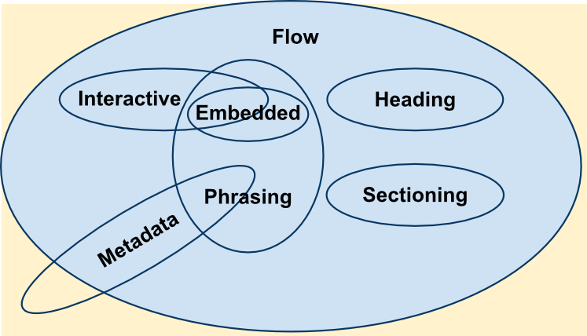
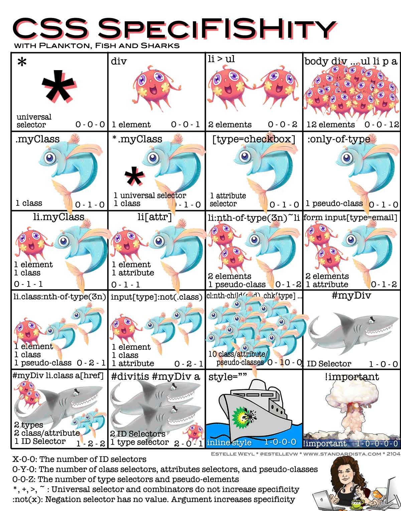
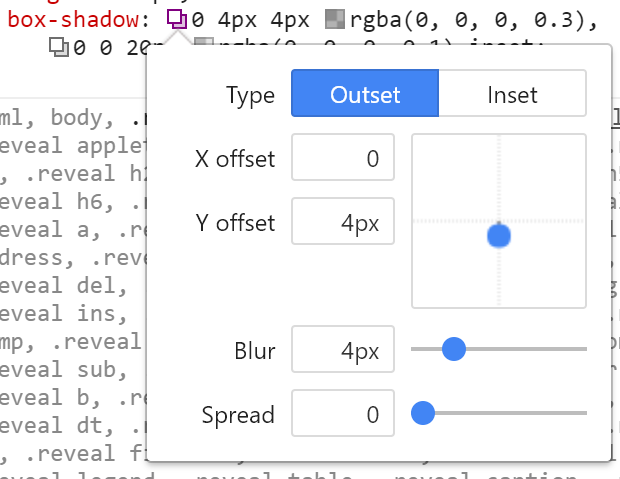
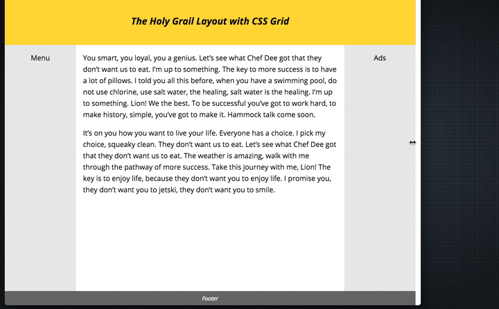
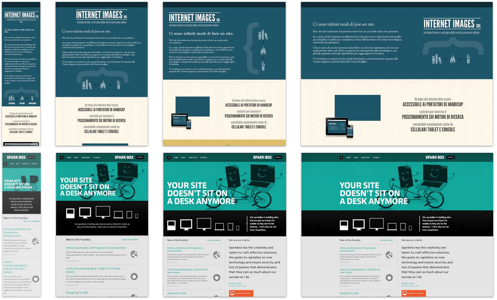
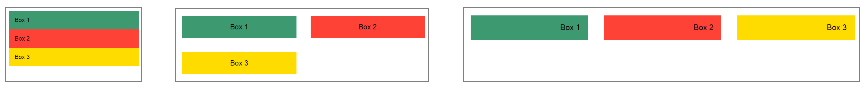

64-31.1 Projet de technologie web
<!-- .element style="font-size:0.7em;margin:4em 0;" -->

# HTML & CSS Summary


<!-- .element style="position:absolute; top:0; left:0;width:40%;" class="nopdf" -->


<!-- .element style="position:absolute; top:0; right:0;width:10%;" class="nopdf" -->

[Boris.Fritscher@he-arc.ch](mailto:Boris.Fritscher@he-arc.ch)
<!-- .element style="position:absolute; bottom:20px; left:0;" class="nopdf" -->


## Web Development

* **HTML** for content
* **CSS** for styling
* **JavaScript** for logic


# <br/>HTML

## Hyper Text Markup Language


### HTML
```html
<!DOCTYPE html>
<html>
  <head>
    <title>Document Title</title>
    <meta charset="utf-8" />
  </head>
  <body>
    <h1>Main heading in my document</h1>
    <p>Look Ma, I am coding <strong>HTML</strong>.</p>

    <!-- This is a comment -->
    <h2>Sub heading</h2>
    <p>Some more text</p>
  </body>
</html>
```
<!-- .element: class="html-preview output-right output-w-40"-->


### HTML: Elements

| Element     | Description
|-------------|------------
| `<!DOCTYPE html>` | Document type must be the very first thing in your HTML document
| `<html>`    | Root of an HTML document
| &nbsp;&nbsp;&nbsp;&nbsp;`<head>`    | Metadata section of the document
| &nbsp;&nbsp;&nbsp;&nbsp;&nbsp;&nbsp;&nbsp;&nbsp;`<title>`   | Defines the title of the document (only text)
| &nbsp;&nbsp;&nbsp;&nbsp;&nbsp;&nbsp;&nbsp;&nbsp;`<meta>`   | Provides machine parsable metadata about the HTML document
| &nbsp;&nbsp;&nbsp;&nbsp;`<body>`    | Contains the content of the document
| `<!--  -->` | Comment everything between < and >
| `<h1>,<h2>,<h3>,<h4>` | Heading most important to least
| `<p>` | A paragraph of text
| `<strong>` | Give text strong importance, displayed in bold


### HTML: Attributes

Elements can have attributes **`name="value"`**

| Attribute   | Description
|-------------|------------
| `< ... id="" ... >` | All element can have an id, must be unique in the page!
| `< ... class="" ... >` | All element can have a list of classes (used for CSS)
| `` | Image from `src` with `alt` description
| `<a href="">` | Anchor, hyperlink to a target destination

```html
<div id="page2">
  <p>A <span class="fun">funny</span> dog:
     </p>
  <p>go to <a href="page3.html">page 3</a></p>
</div>
```

Ids and classes are used by css and javascript to reference specific indvidual or groups of elements.

<!-- .element: class="small" -->


### HTML: More Elements

| Element     | Description
|-------------|------------
| `<div>` | A generic container for elements
| `<nav>` | Represents a section of a page that links to other pages or parts
| `<section>` | A thematic grouping of content
| `<header>` | A page header container for logo, nav, search
| `<footer>` | A page or section footer container
| `<pre>` | Preformatted text, whitespace are displayed as typed
| `<ul>, <ol>` | Unordered list and ordered list
| `<li>` | List item inside a ul or ol
| `<span>` | A generic inline container


### HTML: Tables

```html
<!DOCTYPE html>
<table>
  <caption>Caption of the table (optional)</caption>
  <thead>
    <tr>
      <th>Column A</th> <th>Column B</th> <th>Column C</th>
    </tr>
  </thead>
  <tbody>
    <tr>
      <td>1</td> <td>2</td> <td>3</td>
    </tr>
    <tr>
      <td>4</td> <td colspan="2" rowspan="2">5</td>
    </tr>
    <tr>
      <td>6</td>
    </tr>
  </tbody>
</table>
```
<!-- .element: class="html-preview output-right output-w-30"-->

```css
body{
  font-family: sans-serif;
  font-size: 20px;
}
table{
  border: 1px solid #000;
}

td{
  border: 1px solid #999;
  text-align: center;
}
```
<!-- .element: class="nopdf hide"-->


### HTML: Forms

```html
<form>
  <p><label for="n">Name: </label> <!-- two ways to associate labels -->
  <input id="n" name="name"
         type="text" placeholder="Enter your name"/></p>
  <p><label>Password: <input type="password" /></label></p>

  <p><input type="checkbox" name="on" value="1"/>on
  <!-- radio groups need same name -->
  <input type="radio" name="r" value="1" checked/>1
  <input type="radio" name="r" value="2"/>2</p>

  <p><textarea name="multiline"></textarea></p>

  <p><select name="choice">
    <option value="v1">Value 1</option>
    <option value="v2" selected>Value 2</option>
    <option value="v3">Value 3</option>
    </select></p>

  <p><button>Hello</button> <input type="submit" /></p>
</form>
```
<!-- .element: class="html-preview output-right output-w-25"-->

```css
body{
  font-family: sans-serif;
  font-size: 20px;
}
```
<!-- .element: class="nopdf hide" -->


### HTML: inline elements

An inline element occupies only the space bounded by the tags that define the inline element.

* may contain only data and other inline elements.
* do not begin with new line.

> strong, a, img, span, button, input, label, select, textarea


### HTML: block-level elements

A block-level element occupies the entire space of its parent element (container), thereby creating a "block."

* block-level elements begin on new lines.

> div, ul, form, h1, h2, header, nav, pre, p


### HTML5: content categories

In HTML5, this binary distinction of **block-level** vs. **inline** elements is is replaced with a more complex set of content categories

<!-- .element: class="w-50" -->

<!-- .element: class="center" -->

**block-level** ≈ flow content,
**inline** ≈ phrasing content

<!-- .element: class="small" -->

https://developer.mozilla.org/fr/docs/Web/HTML/Cat%C3%A9gorie_de_contenu

<!-- .element: class="credits" -->


### HTML: including CSS and JavaScript

```html
<!DOCTYPE html>
<html>
  <head>
    <meta charset="utf-8">
    <title>External files</title>
    <link href="css/style.css" rel="stylesheet">
  </head>
  <body>
    ...
    <script src="http://code.jquery.com/jquery.js"></script>
    <script src="js/myscript.js"></script>
  </body>
</html>
```

Later listings take precedence.

Script tags at the end in order to not block page loading.


### Other script loading attributes

```html
<script src="" defer></script>
```
 script is meant to be executed after the document has been parsed, but before firing *DOMContentLoaded*

```html
<script src="" async></script>
```
 specifies that the script will be executed asynchronously as soon as it is available.


- If async is present: The script is executed asynchronously with the rest of the page (the script will be executed while the page continues the parsing)
- If async is not present and defer is present: The script is executed when the page has finished parsing
- If neither async or defer is present: The script is fetched and executed immediately, before the browser continues parsing the page

<!-- .element: class="smaller" -->


# <br/>CSS

## Cascading Style Sheets


### CSS: Selectors

```css
body {
  width: 500px;
}

.tag-class {
    padding: 20px 40px;
    width: auto;
}

a:hover{
  color: red;
}

#tag-id {
    height: 100px;
    float: left;
}

```

element, class, pseudo-class, id


| CSS Selector     | Action                                                              |
|------------------|---------------------------------------------------------------------|
| *		             | selects all elements                                                |
| aa *		         | selects all elements within the aa elements.                        |
| aa bb		         | selects all bb elements within the aa elements.                     |
| aa, bb	         | selects all aa and bb elements, it's just a list.                   |
| aa.classname	   | selects all aa elements with the class classname.                   |
| #idname	         | selects the element with the id idname.                             |
| a:hover	         | selects the a element if the mouse hovers over it (pseudo-classes). |
| aa > bb	         | selects the bb element if it's a direct child of aa.                |
| aa + bb	         | selects the bb element if it's immediately preceded by aa.          |
| aa ~ bb	         | selects every bb element that are preceded by a aa element.         |
| aa[attr="value"] | selects the aa element with a attr="value" attribute.               |
| :first-child     | selects all first child elements.                                   |
| :nth-child(A)    | selects every element that is the Ath child of another element.     |

Visualization:
[CSS Visualizer](https://fritscher.ch/dom-css/)

Exercise:
[CSS Diner](https://flukeout.github.io/)


### CSS: Cascading Rules


[](images/specificitywars-05v2.jpg)

<!-- .element: class="w-50 float-left" -->

[](images/specificity3.jpg)

<!-- .element: class="w-50 float-left" -->


```html
<!DOCTYPE html>
<html>
<body>
  <div id="b1" class="box">BOX1</div>
</body>
</html>
```

```css
#b1.box{
  color: yellow;
}

#b1.box{
  color: pink;
}

.box{
  color: green;
}

#b1 {
  color: blue;
}

div {
  color: red;
}
```


### CSS: box-model


<!-- .element: class="w-50 float-left" -->

***box-sizing: content-box;*** default

***box-sizing: border-box;*** width includes padding + border

Collapsing margins: depending on setting a border or padding, margins are collapsed or put apart. Normally, bottom and top margin margins are merged together.

center a block element: *margin: 0 auto*;

<!-- .element: class="small" -->


### CSS: border

<div style="position:relative" class="float-right">
<div style="width:100px;height:50px;border:4px solid red;position: absolute; top:100px;right:0"></div>
<div style="width:100px;height:50px;border:4px solid red;border-top: 8px dashed green;position: absolute; top:180px;right:0"></div>
<div style="width:100px;height:50px;border:6px solid #0000FF;position: absolute; top:260px;right:0"></div>
<div style="width:100px;height:50px;border:6px solid #0000FF;border-left: 10px double #00FFFF;position: absolute; top:340px;right:0"></div>
<div style="width:100px;height:50px;border:6px solid #0000FF;border-left: 10px double #00FFFF;position: absolute; top:420px;right:0;border-radius: 10px"></div>
</div>

```css
border-width: 4px;
border-color: red;
border-style: solid;

border-top-width: 8px;
border-top-color: green;
border-top-style: dashed;

/* shorthand */
border: 2px solid #0000FF;

border-left: 10px solid #FFFF00;

border-radius: 10px;
```

- https://developer.mozilla.org/en-US/docs/Web/CSS/border-radius?v=example
- http://css3pie.com/demos/border-radius/
- https://developer.mozilla.org/en-US/docs/Web/CSS/CSS_Background_and_Borders/Border-radius_generator

<!-- .element class="smaller" -->


### CSS background

```css
background-color: [#color, gradient];
background-image: url('..image.jpg');
background-position: x y;
background-repeat: [repeat, repeat-x, repeat-y, no-repeat, space, round];
background-size: [auto, x y, cover, contain];

background-clip: [border-box, padding-box, content-box, inherit];
background-origin: [border-box, padding-box, content-box, inherit];
background-attachment: [scroll, fixed, local];
```

- https://css-tricks.com/almanac/properties/b/background/
- http://www.colorzilla.com/gradient-editor/

<!-- .element class="smaller" -->


### CSS text

```css
font-family: [Times New Roman, serif, Arial, sans-serif, Consolas, monospace];
font-style: [normal, italic];
font-weight: [normal, bold, 100-900];
font-size: 20px;
line-height: 30px;
```
<span style="font-family: Times New Roman">Times New Roman,</span>
<span style="font-family: Arial">Arial,</span>
<span style="font-family: Consolas">Consolas,</span>
<span>Open Sans and many more with [WebFonts](https://fonts.google.com/)</span>

<!-- .element class="smaller" -->


<div class="fragment" style="font-size:80px;color:#f0f0f0; text-shadow:0 1px 0 hsl(174,5%,80%), 0 2px 0 hsl(174,5%,75%),0 3px 0 hsl(174,5%,70%),0 4px 0 hsl(174,5%,66%), 0 5px 0 hsl(174,5%,64%),0 6px 0 hsl(174,5%,62%),0 7px 0 hsl(174,5%,61%),0 8px 0 hsl(174,5%,60%),0 0 5px rgba(0,0,0,.05),0 1px 3px rgba(0,0,0,.2),0 3px 5px rgba(0,0,0,.2), 0 5px 10px rgba(0,0,0,.2), 0 10px 10px rgba(0,0,0,.2),0 20px 20px rgba(0,0,0,.3);">... and crazy text-shadow</div>

- https://css-tricks.com/almanac/properties/t/text-shadow/

<!-- .element class="smaller fragment" -->

note:
Browser chooses closest available font.
Use Element > computed style in chrome devtools to see which font is really used.


### CSS box-shadow

<div style="background-color: #9EB3EB;width: 100%; height:100px;box-shadow:-7px 13px 4px rgba(0, 0, 0, 0.3), 0px -2px 20px rgba(0, 0, 0, 0.1) inset;"></div>

Use chrome dev-tools editor to adjust box-shadow.


<!-- .element class="w-40 left" -->

- https://css-tricks.com/almanac/properties/b/box-shadow/

<!-- .element class="smaller right" -->


### CSS: Positioning

`position: static|fixed|absolute|relative;`
* **static** : default not positioned in any special way
* **fixed** : positioned relative to the viewport
* **absolute** : behaves like *fixed* except relative to the nearest positioned ancestor
* **relative** : behaves the same as static unless you add some extra properties.

`top|right|bottom|left: <<units>>;`
<br/>`z-index: <<int>>;` *change ordering of positionned elements*
<br/>`float: left|right;`
<br/>`clear: left|right|both;` *disallow float*


```html
  <header>
    <nav>menu</nav>
  </header>
  <div id="s1" class="square"></div>
  <div id="s2" class="square"></div>
  <div id="s3" class="square"></div>
  <footer>Bottom</footer>
```
<!-- .element: class="w-50 float-left" -->

```css
header{
  position: relative;
  top: 100px;
  background-color: #FF4136;
  height: 100px;
}

nav{
  position: absolute;
  background-color: #FFDC00;
  width: 50%;
  right: 0;
  bottom: 0;
}

.square{
  position: absolute;
  width: 50px;
  height: 50px;
}

#s1{
  top: 250px;
  background-color: #001f3f;
  left: calc(50% - 25px);
  z-index: 99;
}

#s2{
  top: 240px;
  background-color: #0074D9;
  left: 50%;
}

#s3{
  top: 260px;
  background-color: #7FDBFF;
  left: 48%;
}

footer{
  position:fixed;
  bottom:0;
  background-color: #2ECC40;
  width: 100%;
}
```
<!-- .element: class="w-50 float-left" -->


```html
  <div class="box">a</div>
  <div class="box">b</div>
  <div class="box">c</div>
  <div class="box">d</div>
  <h1>title</h1>
```
<!-- .element: class="nopdf" -->

```css
.box{
  border: 3px solid #FF851B;
  width: 30%;
  float:left;
  margin: 1%;
}

h1{
  clear: left;
}
```
<!-- .element: class="nopdf" -->


### CSS: Flexbox

https://css-tricks.com/snippets/css/a-guide-to-flexbox/
<!-- .element: class="small" -->

<!-- .element: class="w-60" -->
<!-- .element: class="center" -->

https://philipwalton.github.io/solved-by-flexbox/
<!-- .element: class="small" -->

Exercise: [Flexbox Froggy](https://flexboxfroggy.com/)

http://blog.teamtreehouse.com/responsive-design-of-the-future-with-flexbox

<!-- .element: class="credits" -->


### CSS: Grid

<!-- .element: class="w-70" -->
<!-- .element: class="center" -->

Exercise: [Grid Garden](http://cssgridgarden.com/)

https://bitsofco.de/holy-grail-layout-css-grid/

<!-- .element: class="credits" -->


### Source-Order Independence


https://drafts.csswg.org/css-grid/

https://gridbyexample.com/

https://css-tricks.com/snippets/css/complete-guide-grid/


### CSS: Media Queries

Lets the presentation of content be **tailored** to a specific range of output devices **without having to change the content** itself.

> `@media` **some rule** `[and|or]` **some other rule**
> { **CSS for only this selection** }

**rules:** min-width, max-width, min-device-width, max-device-width, orientation: [landscape | portrait], ...

https://developer.mozilla.org/fr/docs/Web/CSS/Media_queries


### CSS: Media Queries Bootstrap3 breakpoints
```css
/* Custom, iPhone Retina */
@media only screen and (min-width : 320px) {

}
/* Extra Small Devices, Phones */
@media only screen and (min-width : 480px) {

}
/* Small Devices, Tablets */
@media only screen and (min-width : 768px) {

}
/* Medium Devices, Desktops */
@media only screen and (min-width : 992px) {

}
/* Large Devices, Wide Screens */
@media only screen and (min-width : 1200px) {

}
```


#### Media Queries Examples



http://mediaqueri.es/spa/
http://mediaqueri.es/int/

<!-- .element: class="credits" -->


```html
<div id="box1">Box 1</div><div id="box2">Box 2</div><div id="box3">Box 3</div>
```

```css
*{ box-sizing: border-box; }
body{ font-family: sans-serif; font-size: 20px; }
/* default mobile first */
#box1{ background-color: #3D9970; }
#box2{ background-color: #FF4136; }
#box3{ background-color: #FFDC00; }
#box1, #box2, #box3{ padding: 1em; }
/* first breakpoint */
@media only screen and (min-width : 600px) {
  #box1, #box2, #box3{
    float:left;
    width: 50%;
    text-align: center;
    border: 1em solid #fff;
  }
}
/* second breakpoint */
@media only screen and (min-width : 992px) {
  #box1, #box2, #box3{
    width: 33%;
    text-align: right;
  }
}
```



<!-- .element: class="center" -->


### CSS Variables (Custom Properties)

Can be changed dynamically, follow CSS inheritance, can be changed from JavaScript

write:

```css
--var_name: value;
```

read:

```css
var(--var_name);
```

https://drafts.csswg.org/css-variables/

https://www.smashingmagazine.com/2017/04/start-using-css-custom-properties/


```html
<h1>Title</h1>
<p>Some Text <span class="primary">primary text color</span></p>
<div class="box">box</div>
<div class="box">box</div>
```

```css
:root { /* or any other css selector */
  --primary-color: red;
  --indent-size: 10px;
  --indent-xl: calc(2*var(--indent-size));
  --spacer: 10;
}

h1, h2 {
   color: var(--primary-color);
}
.primary {
   color: var(--primary-color);
}
.box {
  padding: var(--indent-xl);
}

.box2{
  padding: var(--spacer)px 0; /* DOESN'T work */
  padding: calc(var(--spacer)*1px) 0; /* WORKS */
}
```


### CSS transition and animation

<iframe height='320' scrolling='no' title='Css3 Spinners' src='//codepen.io/huckbit/embed/RRmyzY/?height=265&theme-id=light&default-tab=result&embed-version=2' frameborder='no' allowtransparency='true' allowfullscreen='true' style='width: 100%;'>See the Pen <a href='https://codepen.io/huckbit/pen/RRmyzY/'>Css3 Spinners</a> by Massimiliano Ranauro (<a href='https://codepen.io/huckbit'>@huckbit</a>) on <a href='https://codepen.io'>CodePen</a>.
</iframe>

- http://easings.net/ (easing functions)
- https://developer.mozilla.org/en-US/docs/Web/CSS/CSS_Animations/Using_CSS_animations


### References

* http://caniuse.com/
* https://developer.mozilla.org/fr/docs/Web/HTML/Element
* https://developer.mozilla.org/fr/docs/Web/Guide/HTML/Formulaires/Les_blocs_de_formulaires_natifs
* http://tympanus.net/codrops/css_reference/
* https://developer.mozilla.org/fr/docs/Web/CSS/Reference
* http://www.w3.org/Style/css3-selectors-updates/WD-css3-selectors-20010126.fr.html
* http://css.sutterlity.fr/
* http://fr.learnlayout.com/
* https://developer.mozilla.org/fr/docs/CSS/Premiers_pas


<!-- .element: class="background top right w-33" -->


### Sources
* Cours TWEB@heig-vd, Olivier Liechti https://github.com/wasadigi/Teaching-HEIGVD-TWEB/
* yeoman pictures - http://yeoman.io/
