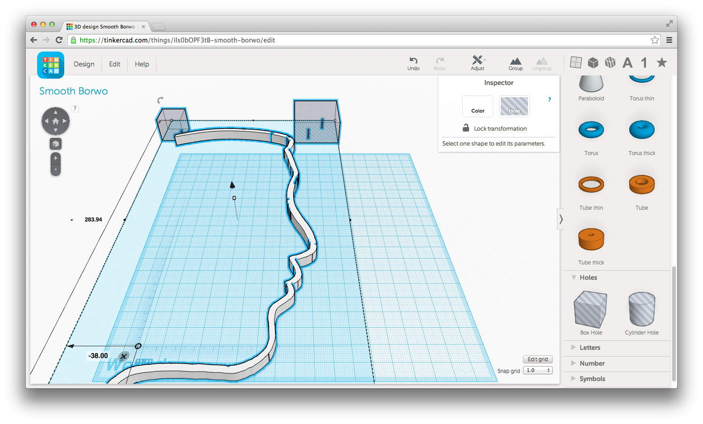
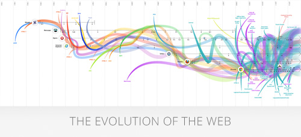
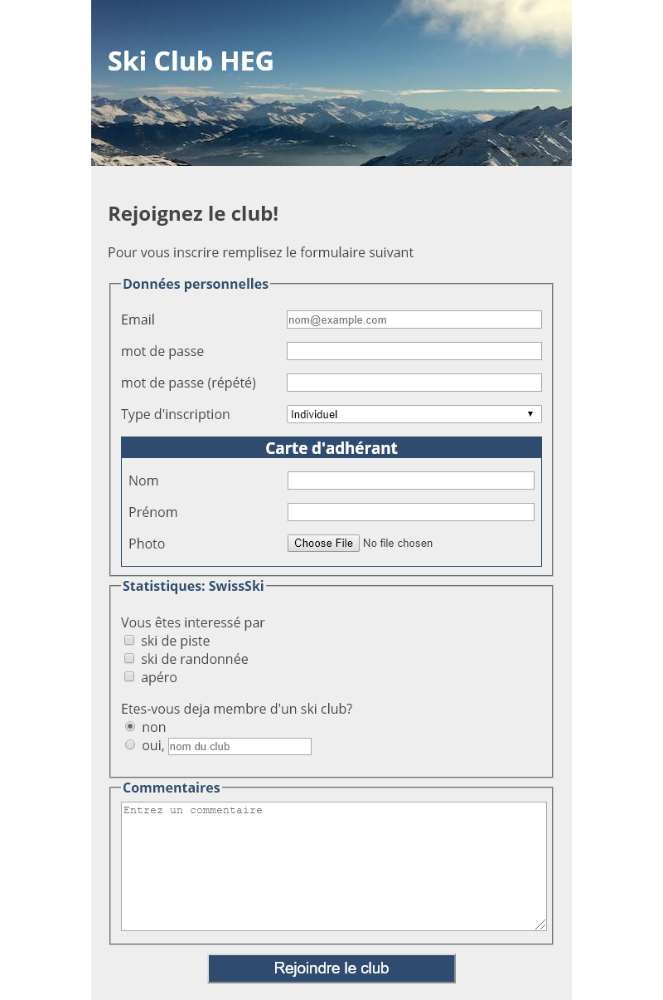
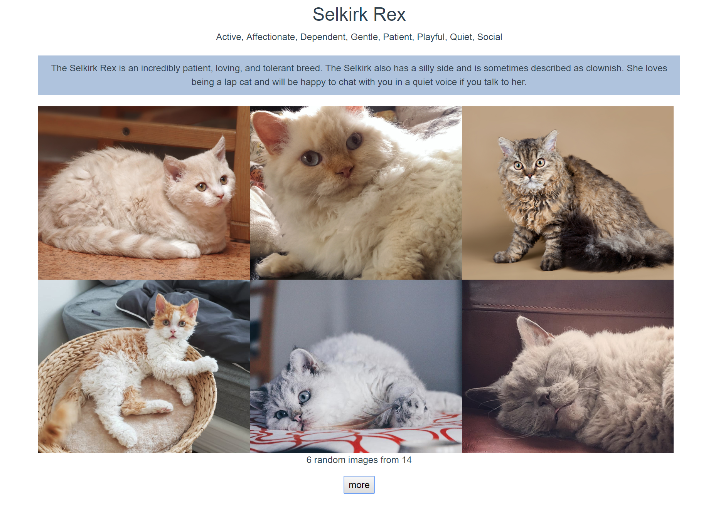

64-31.1 Projet de technologie web
<!-- .element style="font-size:0.7em;margin:4em 0;" -->

# Introduction

<!-- .element style="position:absolute; top:0; left:0;width:40%;" class="nopdf" -->

<!-- .element style="position:absolute; top:0; right:0;width:10%;" class="nopdf" -->

[Boris.Fritscher@he-arc.ch](mailto:Boris.Fritscher@he-arc.ch)
<!-- .element style="position:absolute; bottom:20px; left:0;" class="nopdf" -->

# A propos de vous?

<!-- .element: class="center nopdf" -->

[https://marmix.ig.he-arc.ch/poll/](https://marmix.ig.he-arc.ch/poll/)

# Introduction
 

## Le Web comme plateforme d'applications

### Evolution du web

1993: Web dans Mosaic

<!-- .element: class="w-60" -->

<!-- .element: class="w-50 float-left center" -->

2014: TinkerCAD dans Chrome

<!-- .element: class="w-50 float-left center" -->

<!-- .element: class="center" -->

### 2020 dans l'espace

#### Les applications web deviennent de plus en plus puissantes;

Multimédia<!-- .element: class="w-60 pdf-w-30 pdf-float-left" -->

<!-- .element: class="w-33 float-left center" -->

Performance<!-- .element: class="w-60 pdf-w-30 pdf-float-left" -->

<!-- .element: class="w-33 float-left center" -->

Accès&nbsp;aux&nbsp;appareils<!-- .element: class="w-60 pdf-w-30 pdf-float-left" -->

<!-- .element: class="w-33 float-left center" -->

Connectivité<!-- .element: class="w-60 pdf-w-30 pdf-float-left" -->

<!-- .element: class="w-33 float-left center" -->

Stockage/hors&nbsp;ligne<!-- .element: class="w-60 pdf-w-30 pdf-float-left" -->

<!-- .element: class="w-33 float-left center" -->

<!-- .element: class="w-60 pdf-w-30 pdf-float-left" -->
Graphiques

<!-- .element: class="w-33 float-left center" -->

http://www.w3.org/html/logo/

<!-- .element: class="credits" -->

Note:
**Stockage/Hors ligne :**
Les applications web peuvent démarrer plus rapidement et fonctionner même sans connexion Internet, grâce à l’App Cache HTML5, ainsi qu’aux spécifications Local Storage, Indexed DB et File API.

**Connectivité :**
Une connectivité plus efficace permet davantage de chats en temps réel, des jeux plus rapides et une meilleure communication. Les Web Sockets et Server-Sent Events transmettent les données entre client et serveur plus efficacement que jamais.

**Accès aux appareils :**
À commencer par l’API de géolocalisation, les applications web peuvent offrir des fonctionnalités et expériences riches, adaptées à l’appareil. Des innovations incroyables permettent l’accès à l’audio/vidéo (microphones, caméras), aux données locales (contacts, événements), et même à l’orientation de l’appareil.

**Multimédia :**
L’audio et la vidéo sont des éléments de première classe dans le web HTML5, s’intégrant harmonieusement à vos applications et sites. Lumière, caméra, action !

**Performance :**
Rendez vos applications web et contenus dynamiques plus rapides grâce à diverses techniques et technologies comme les Web Workers et XMLHttpRequest 2. Aucun utilisateur ne devrait attendre sur votre montre.

**Graphiques :**
Entre SVG, Canvas, WebGL et les fonctionnalités 3D de CSS3, vous pouvez impressionner vos utilisateurs avec des visuels époustouflants rendus nativement dans le navigateur.

## Tendances

* Single Page Applications (SPA)
* Progressive Web Apps (PWA)
* Temps réel
* Outils
* Flux de travail de développement automatisés

<!-- .element: class="w-50 float-left center" -->

<!-- .element: class="w-50 float-left center" -->

## Languages, Plateformes, Communautés

Client 

<!-- .element: class="w-50 float-left center" -->

Serveur 
?<!-- .element: style="font-size:4em" -->

<!-- .element: class="w-50 float-left center" -->

Note:
Le serveur peut être développé dans de nombreux langages et frameworks différents :
* PHP: Laravel, Symfony, CakePHP
* Python: Django
* Ruby: Rails
* Java: J2EE, Spring, Play
* .NET: ASP.NET

Mais aussi en JavaScript
* JS: Node.js, express.js

### Objectif : Apprendre à créer et déployer une application web client.

Note:

Apprenez la théorie et les outils, découvrez des exemples et pratiquez !

## Exercices & Labos

<!-- .element: class="w-40 float-left pdf-w-40 pdf-float-left" -->

<!-- .element: class="w-40 float-right pdf-w-40 pdf-float-right" -->

### Planning

*Partie 1* *Partie 2*<!-- .element: style="margin-left: 40%;" -->

* <!-- .element: style="width:32px;margin:0" --> HTML, CSS, JavaScript
* <!-- .element: style="width:32px;margin:0" --> Beaucoup d'exercices
*  <!-- .element: style="width:32px;margin:0" --> Examen

<!-- .element: class="w-50" -->

* <!-- .element: style="width:32px;margin:0" --> Vue.js
* <!-- .element: style="width:32px;margin:0" --> Lab: CatList
* <!-- .element: style="width:32px;margin:0" --> Projets

<!-- .element: class="w-40" -->

 *Notes*
* Examen: note individuelle 33%
* Projet: note de groupe 66%
  * Projet (CatList++ / propre idée)
  * Présentation

<!-- .element: class="left" -->

<!-- .element: class="w-30 right bottom background" -->
