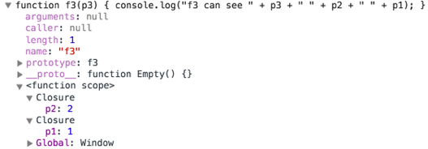
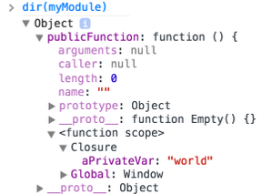

64-31.1 Projet de technologie web
<!-- .element style="font-size:0.7em;margin:4em 0;" -->

# Javascript Extended


<!-- .element style="position:absolute; top:0; left:0;width:40%;" class="nopdf" -->


<!-- .element style="position:absolute; top:0; right:0;width:10%;" class="nopdf" -->

[Boris.Fritscher@he-arc.ch](mailto:Boris.Fritscher@he-arc.ch)
<!-- .element style="position:absolute; bottom:20px; left:0;" class="nopdf" -->


## JavaScript 101 (Part 2)

* Scopes
* Objects
* Prototypal inheritance
* More on functions
* Constructors
* Classes
* Arrays the functional way


### Scopes before ECMAScript 2015

There are 2 scopes for variables:

* the (evil) global scope
* the function scope

A variable declared within a
function is **not accessible**
outside this function.<br/><br/>
Unless using **strict mode**, it
is not mandatory to declare
variables (beware of typos…)<br/><br/>
Two scripts loaded from the
same HTML page share the
same global scope (beware of
**conflicts**…)<br/><br/>
There is **no block scope**.

<!-- .element: class="w-40 float-right smaller" -->

```javascript
var aVariableInGlobalScope;

function myFunction() {
  var aVariableInFunctionScope;
  anotherVariableInGlobalScope;
}

function myFunction2() {
  //no block scope!
  for(i = 0; i < 10; i++){
    //i is in global scope!
  }
  for(var j = 0; j < 10; j++){
    //j is in function scope!
  }
}
```
<!-- .element: class="w-50 float-left" -->


### Exploring scopes

```javascript
var aGlobalVar = 'hello';
var anotherGlobalVar = 'world';
function myFunction() {
    aGlobalVar = 'yo';
    var anotherGlobalVar = 'yeep';
    var localVar = 'local';
    iAmNotALocalVariable = 'iAmGlobal';
}
console.log('1. aGlobalVar: ' + aGlobalVar);
console.log('2. anotherGlobalVar: ' + anotherGlobalVar);

myFunction();
console.log('3. aGlobalVar: ' + aGlobalVar);
console.log('4. anotherGlobalVar: ' + anotherGlobalVar);
console.log('5. iAmNotALocalVariable: ' + iAmNotALocalVariable);
console.log('6. localVar: ' + localVar);
```


### Creating objects

JavaScript has **no support for classes** (< ECMAScript 2015)

There are 3 ways to create objects:

**`class`** is a reserved word in
JavaScript, but it is not used
in the current version of the
language (reserved for the
future ECMAScript 2015).<br/><br/>
A **constructor** is function like
any other (capitalized is a
coding convention).<br/><br/>
It is the use of the **new**
keyword that triggers the
object creation process.

<!-- .element: class="w-40 float-right smaller" -->

```javascript
//create an object with a literal
const person = {
  firstName: 'John',
  lastName: 'Smith'
};

// create an object with a prototype
let child = Object.create(person);

// create an object with a constructor
child = new Person('John', 'Smith');
```
<!-- .element: class="w-50 float-left" -->


### Every object inherits from a prototype object

```javascript
var person = {
    firstName: 'John',
    lastName: 'Smith'
};
// person's prototype is Object.prototype
console.log(Object.getPrototypeOf(person) === Object.prototype);

const father = {};
const child = Object.create(father);
// child's prototype is father
console.log(Object.getPrototypeOf(child) === father);

function Person(fn, ln) {
    this.firstName = fn;
    this.lastName = ln;
}
const john = new Person('John', 'Doe');
// john's prototype is Person.prototype
console.log(Object.getPrototypeOf(john) === Person.prototype);
```


### Every object inherits from a prototype object

<!-- TODO: maybe drawing -->

Every object inherits from a prototype object.
**It inherits and can override its properties**, including its methods.

Objects created with object literals inherit from **Object.prototype**.

When you access the property of an object,
JavaScript **looks up the prototype chain**
until it finds an ancestor that has a value for
this property.


### Class-like data structure

**badGreet** is a property that
will be replicated for every
object created with the
Person constructor:<br/>
 - poor memory management<br/>
 - not possible to alter
behavior of all instances at
once<br/><br/>
**greet** is a property that will
be shared by all instances
(because it will be looked up
along the object inheritance
chain).<br/><br/>
**privateVar** is not accessible
outside of the constructor.<br/><br/>
**fistName** is publicly accessible (no encapsulation).

<!-- .element: class="w-40 float-right smaller" -->

```javascript
function Person(fn, ln) {
    var privateVar;
    this.firstName = fn;
    this.lastName = ln;
    this.badGreet = function () {
      console.log('Hi ' + this.firstName);
    };
}

Person.prototype.greet = function () {
    console.log('Hey ' + this.firstName);
};

const p1 = new Person('John', 'Smith');

p1.badGreet();
p1.greet();
```
<!-- .element: class="w-50 float-left" -->


### Classes since ECMAScript 2015

```javascript
class SkinnedMesh extends THREE.Mesh {
  constructor(geometry, materials) {
    super(geometry, materials);

    this.idMatrix = SkinnedMesh.defaultMatrix();
    this.bones = [];
    this.boneMatrices = [];
    //...
  }
  update(camera) {
    //...
    super.update();
  }
  static defaultMatrix() {
    return new THREE.Matrix4();
  }
}
```


### Arrays the functional way

```javascript
const fruits = ['abricot', 'ananas', 'strawberry', 'orange'];

// creates a new array with the results of calling a provided function
// on every element in the calling array.
const transformedFruits = fruits.map(fruit => {
    return fruit.toUpperCase();
});

// executes a provided function once for each array element.
transformedFruits.forEach(fruit => {
    console.log(fruit);
});

// creates a new array with all elements that pass the test implemented
// by the provided function.
const aFruits = fruits.filter(fruit => {
    return fruit.charAt(0) === 'a';
});
```


### Arrays the functional way

```javascript
const fruits = ['abricot', 'ananas', 'strawberry', 'orange'];

// executes a reducer function (that you provide)
// on each element of the array,
// resulting in a single output value.

const count = fruits.reduce((val, fruit) => {
    console.log('reducer invoked with ' + val);
    return val + 1;
}, 0);
console.log('There are ' + count + ' fruits in the array');
```

There are more functional methods: sort, some, every, flat, flatMap
https://developer.mozilla.org/en-US/docs/Web/JavaScript/Reference/Global_Objects/Array

<!-- .element: class="small" -->


### DOM Document

```javascript
// access body Element
const element = document.body;

// find element(s)
const element = document.getElementById("some_id");

// returns an Element
const parentElement = document.querySelector("ul");

// returns an iterable of Elements
const elements = document.querySelectorAll("li");
const element = elements[0];

// create a new element
const element = document.createElement("div");

// add to DOM
parentElement.append(element);
```

https://github.com/oneuijs/You-Dont-Need-jQuery
<!-- .element class="small" -->


### DOM Element

```javascript
// edit classes
element.classList.add("big");
element.classList.remove("big");
element.classList.toggle("big");

// edit content
const value = element.innerText;
element.innerText = "some text";
element.innerHTML = "text with <b>HTML</b>";

// edit attributes
const value = element.getAttribute("src");
element.setAttribute("src", "https://...");

// events: click, dblclick, change, keydown, mouseenter, mouseleave
element.addEventListener('click', () => {
  // handler function
  // do something
});
```


```html
<!DOCTYPE html>
<html>
<body onload="onload()">
  <ul class="list">
    <li>a</li>
    <li>b</li>
  </ul>
</body>
</html>
```

```css
.big{
  font-size: 200%;
}
```

```javascript
function onload() {
  const div = document.createElement('div');
  div.innerText = 'Hello';
  document.body.append(div);

  for (const li of document.querySelectorAll('.list li')) {
    li.addEventListener('click', () => {
      li.classList.toggle('big');
    })
  }
}
```


# JavaScript 101 (Part 3)

* Functions are objects
* Closures
* Module patterns
* this


### Functions are objects

```javascript
function aFunc(){ return true; } // no semicolon

// anonymous function
const f = function(i){ return i; }; // semicolon since assignment

const g = function g(i){
  if(i > 100){
    return i;
  }
  return g(i+1); // recursive call
};
const h = function(aFunctionObj){
  // 3 ways to call a function
  console.log(aFunctionObj(0));
  console.log(aFunctionObj.apply(this, [0]));
  console.log(aFunctionObj.call(this, 0));
};

h(f);
h(g);
```


### Functions can be nested

An **object** is created for every function.

Each function has access to variables defined in the **parent** functions (an in the **global scope**).

```javascript
function f1(p1){
  console.log('f1 can see ' + p1);
  function f2(p2){
    console.log('f2 can see ' + p2 + ' ' + p1);
    function f3(p3){
      console.log('f3 can see ' + p3 + ' ' + p2 + ' ' + p1);
    }
    f3(3);
  }
  f2(2);
}
f1(1);
```


### Closures

A closure is formed when a nested function accesses a **free variable**

<!-- .element: class="w-40" -->

* In a function, a **free variable** is a variable that is neither a local variable, nor a parameter of the function.
* A **closure** is the combination of a code block (the function code) and saved parent scopes.

<!-- .element: class="small" -->


```javascript
function f1(p1){
  console.log('f1 can see ' + p1);
  function f2(p2){
    console.log('f2 can see ' + p2 + ' ' + p1);
    function f3(p3){
      console.log('f3 can see ' + p3 + ' ' + p2 + ' ' + p1);
    }
    f3(3);
  }
  f2(2);
}
f1(1);
```

<!-- .element: class="top right" -->


### Module patterns in ES5

Patterns are applied to create modules

When `privateFunction1` accesses `aPrivateVar`, a **closure** is formed.<br/><br/>
`privateFunction1` is **available even after** the immediately invoked function has returned.<br/><br/>
`privateFunction1` and `privateFunction2` share the same parent scope.

<!-- .element: class="w-33 float-right smaller" -->

```javascript
var myModule = (function(){

    var aPrivateVar = 'World';
    var privateFunction1 = function(){
        console.log('Hello ' + aPrivateVar);
    };
    var privateFunction2 = function(){};

    // Make some elements public
    return {
      publicFunction: privateFunction1
    };
})(); // The function is immediately invoked

myModule.publicFunction();
```
<!-- .element: class="w-66 float-left" -->

<!-- .element: class="top right" -->


### Modules since ECMAScript 2015

import/export functions and variables between files.

```javascript
// lib/math.js
export function sum(x, y) {
  return x + y;
}
export const pi = 3.141593;
```

```javascript
// app.js
import * as math from "lib/math";
console.log("2π = " + math.sum(math.pi, math.pi));
```


### import/export syntax
```javascript
import defaultMember from "module-name";
import * as name from "module-name";
import { member } from "module-name";
import { member as alias } from "module-name";
import { member1 , member2 } from "module-name";
import { member1 , member2 as alias2 , [...] } from "module-name";
import defaultMember, { member [ , [...] ] } from "module-name";
import defaultMember, * as name from "module-name";
import "module-name";
```

```javascript
export { name1, name2, …, nameN };
export { variable1 as name1, variable2 as name2, …, nameN };
export let name1, name2, …, nameN; // also var
export let name1 = …, name2 = …, …, nameN; // also var, const

export default expression;
export default function (…) { … } // also class, function*
export default function name1(…) { … } // also class, function*
export { name1 as default, … };

export * from …;
export { name1, name2, …, nameN } from …;
export { import1 as name1, import2 as name2, …, nameN } from …;
```

https://developer.mozilla.org/en-US/docs/Web/JavaScript/Reference/Statements/import<br/>
https://developer.mozilla.org/en-US/docs/Web/JavaScript/Reference/Statements/export

<!-- .element: class="credits" -->


### this

* How the function is called: determines the `this` value
* It is dynamic, which means the value could change
* You can change the `this` context through `.call()`, `.apply()` and `.bind()`

```javascript
// let's assume .elem is <div class="elem"></div>
const element = document.querySelector('.elem');

// our function
const someFunc = function () {
  console.log(this);
};

// when clicked, `this` will become the element
element.addEventListener('click', someFunc); // <div>

// if we just invoke the function, `this` becomes the window object
someFunc(); // [object Window]
```


### Saving this scope

```javascript
const obj = {};
obj.myMethod = function () {
  console.log(this); // this = obj
    setTimeout(function () {
        console.log(this); // window object :O!!!
    }, 100);
};
obj.myMethod();
```

```javascript
const obj = {};
obj.myMethod = function () {

  var that = this; //saving this scope

  console.log(this); // this = obj
    setTimeout(function () {
        console.log(that); // that (this) = obj
    }, 100);
};
obj.myMethod();
```

http://toddmotto.com/understanding-the-this-keyword-in-javascript/

<!-- .element: class="credits" -->


## ECMAScript 2015-2016

 - Enhanced Object Literals
 - Destructuring
 - Default + Rest + Spread


### Enhanced Object Literals

```javascript
const make = 'Kia', model = 'Sorento', value = 40000
const car = {
  // with property value shorthand
  // syntax, you can omit the property
  // value if key matches variable
  // name
  make,  // same as make: make
  model, // same as model: model
  value, // same as value: value

  // computed values now work with
  // object literals
  ['make' + make]: true,

  // Method definition shorthand syntax
  // omits `function` keyword & colon
  depreciate() {
    this.value -= 2500;
  }
};
```

http://www.benmvp.com/learning-es6-enhanced-object-literals/

<!-- .element: class="credits" -->


### Destructuring

```javascript
// list matching
const [a, ,b] = [1,2,3];
a === 1;
b === 3;

// Fail-soft destructuring
const [a] = [];
a === undefined;

// Fail-soft destructuring with defaults
[a = 1] = [];
a === 1;

// object matching
const {name: n, likes: [,,c]} = {name: 'hello', likes: ['cat', 'dog', 'cow']};
n === 'hello';
c === 'cow';
```


### Default + Rest + Spread
```javascript
function f(x, y=12) {
  // y is 12 if not passed (or passed as undefined)
  return x + y;
}
f(3) == 15

function f(x, ...y) {
  // y is an Array
  return x * y.length;
}
f(3, "hello", true) == 6

function f(x, y, z) {
  return x + y + z;
}
// Pass each elem of array as argument
f(...[1,2,3]) == 6
```


### ECMAScript 2015-2016

And a lot more:
- Iterators
- Generators
- Unicode
- Map, Set, WeakMap, WeakSet
- Proxies
- Symbols
- Async Await
- Tail Calls

https://github.com/DrkSephy/es6-cheatsheet<br/>
https://babeljs.io/learn-es2015/

<!-- .element: class="credits" -->


### References

* https://developer.mozilla.org/fr/docs/Web/JavaScript/Une_r%C3%A9introduction_%C3%A0_JavaScript
* https://developer.mozilla.org/fr/docs/Web/JavaScript/Guide
* https://developer.mozilla.org/en-US/Learn/Getting_started_with_the_web/JavaScript_basics
* http://sutterlity.gitbooks.io/apprendre-jquery/content/rappel_javascript.html
* http://eloquentjavascript.net/
* https://developer.chrome.com/devtools
* https://babeljs.io/learn-es2015/


### Sources
* Cours TWEB@heig-vd, Olivier Liechti https://github.com/wasadigi/Teaching-HEIGVD-TWEB/
